# Tutorial : RNA-seq analysis using RASflow_IFB

<small>Maintained by [Magali Hennion](mailto:magali.hennion@u-paris.fr). Last update : 17/11/2021. RASflow_IFB v0.6. </small>  
**Important! The RPBS version of the workflow has NOT been updated since February 2021.** 

Implemented by BIBS-EDC (on IFB and iPOP-UP clusters), this workflow for RNA-seq data analysis is based on RASflow which was originally published by [X. Zhang](https://doi.org/10.1186/s12859-020-3433-x). It has been modified to run effectively on both IFB and iPOP-UP core cluster and to fit our specific needs. Moreover, several tools and features were added, including a comprehensive report, as well as the possibility to incorporate the repeats in the analysis. If you encounter troubles or need additional tools or features, you can create an issue on the [GitHub repository](https://github.com/parisepigenetics/RASflow_IFB/issues), or email directly [Magali](mailto:magali.hennion@u-paris.fr). The tutorial is detailed for the IFB cluster. A small paragraph at the end gives you the instructions to run it on RPBS cluster. The instructions concerning iPOP-UP cluster are coming soon. 

---
## Table of content
  * [Your analysis in a nutshell](#your-analysis-in-a-nutshell)
  * [Resources](#resources)
  * [Get an account on IFB core cluster and create a project](#get-an-account-on-ifb-core-cluster-and-create-a-project)
  * [Connect to IFB core cluster](#connect-to-ifb-core-cluster)
    + [Easy connection : use the Jupyter Hub!](#easy-connection--use-the-jupyter-hub)
    + [SSH connection](#ssh-connection)
  * [RASflow installation and description](#rasflow-installation-and-description)
  * [Quick start with the test dataset](#quick-start-with-the-test-dataset)
  * [Transfer your data](#transfer-your-data)
    + [FASTQ names](#fastq-names)
    + [Generate md5sum](#generate-md5sum)
    + [Copy to the cluster](#copy-to-the-cluster)
    + [Check md5sum](#check-md5sum)
  * [Preparing the run](#preparing-the-run)
    + [1. **metadata.tsv**](#1-metadatatsv)
    + [2. **config_main.yaml**](#2-configmainyaml) 
    + [3. **Workflow.sh** [Facultative]](#3-workflowsh-facultative)
    + [4. **env.yaml** [Facultative]](#4-envyaml-facultative)
  * [Running the workflow](#running-the-workflow)
  * [Running your analysis step by step](#running-your-analysis-step-by-step)
    + [FASTQ quality control](#fastq-quality-control)
    + [Description of the log files](#description-of-the-log-files)
      - [1. **Main script**](#1-main-script)
      - [2. **Snakefiles**](#2-snakefiles)
      - [3. **Individual tasks**](#3-individual-tasks)
      - [4. **Configuration and timing**](#4-configuration-and-timing)
    + [FastQC results](#fastqc-results)
    + [Trimming](#trimming)
    + [Mapping and counting](#mapping-and-counting)
    + [Repeats analysis](#repeats-analysis)
    + [Differential expression analysis and visualization](#differential-expression-analysis-and-visualization)
  * [Workflow results](#workflow-results)
    + [Final report](#final-report)
    + [Trimmed reads](#trimmed-reads)
      - [Trimming report](#trimming-report)
      - [FastQC of trimmed reads](#fastqc-of-trimmed-reads)
    + [Mapped reads](#mapped-reads)
    + [BigWig](#bigwig)
    + [Mapping QC](#mapping-qc)
    + [Counting](#counting)
    + [DEA results](#dea-results)
  * [How to follow your jobs](#how-to-follow-your-jobs)
    + [Running jobs](#running-jobs)
    + [Information about past jobs](#information-about-past-jobs)
    + [Cancelling a job](#cancelling-a-job)
  * [Having errors?](#having-errors)
  * [Common errors](#common-errors)
    + [Error starting gedit](#error-starting-gedit)
    + [Initial QC fails](#initial-qc-fails)
    + [Memory](#memory)
    + [Folder locked](#folder-locked)
    + [Storage space](#storage-space)
  * [Good practice](#good-practice)
  * [Juggling with several projects](#juggling-with-several-projects)
  * [Tricks](#tricks)
    + [Make aliases](#make-aliases)
    + [Quickly change fastq names](#quickly-change-fastq-names)
  * [Running your analysis on RPBS cluster](#running-your-analysis-on-rpbs-cluster)

<small><i><a href='http://ecotrust-canada.github.io/markdown-toc/'>Table of contents generated with markdown-toc</a></i></small>

---
## Your analysis in a nutshell
- Get an [account](#get-an-account-on-ifb-core-cluster-and-create-a-project) on IFB core cluster and create a project
- [Transfer your data](#transfer-your-data) to the cluster
- [Clone](#rasflow-installation-and-description) RASflow_IFB [repository](https://github.com/parisepigenetics/RASflow_IFB)
- [Modify](#preparing-the-run) `metadata.tsv` and `config_main.yaml`
- Run the [workflow](#running-the-workflow) typing `sbatch Workflow.sh`
- Look at the [results](#workflow-results)

Here is a simplified scheme of the workflow. The main steps are indicated in the blue boxes. RASflow will allow you to choose which steps you want to execute for your project. In the green circles are the input files you have to give for the different steps. 

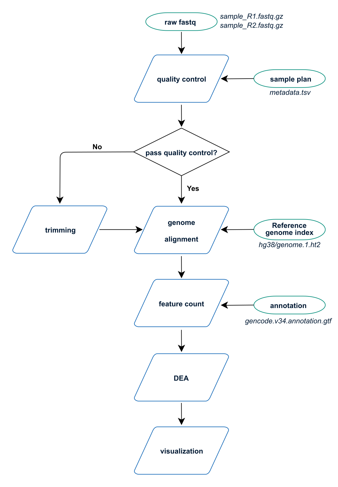

---
---

## Resources

- IFB  
  - Create and manage your [account](https://my.cluster.france-bioinformatique.fr/manager2/login)  
  - Community [support](https://community.cluster.france-bioinformatique.fr)   
  - [Documentation](https://ifb-elixirfr.gitlab.io/cluster/doc/)
  - [Jupyter Hub](https://jupyterhub.cluster.france-bioinformatique.fr)  

- RASflow, Zhang, X.  
  - [Original article](https://doi.org/10.1186/s12859-020-3433-x): RASflow: an RNA-Seq analysis workflow with Snakemake, Xiaokang Zhang & Inge Jonassen, BMC Bioinformatics  21, 110 (2020)  
  - RASflow [original git repository](https://github.com/zhxiaokang/RASflow)    
  - [Tutorial](https://github.com/zhxiaokang/RASflow/blob/master/Tutorial.pdf)

- Tools implemented
  - [FastQC](https://www.bioinformatics.babraham.ac.uk/projects/fastqc/)
  - [MultiQC](https://multiqc.info/docs/)
  - [Trim Galore](https://www.bioinformatics.babraham.ac.uk/projects/trim_galore/)
  - [HISAT2](https://ccb.jhu.edu/software/hisat2/manual.shtml)
  - [STAR](https://github.com/alexdobin/STAR/blob/master/doc/STARmanual.pdf)
  - [Samtools](http://www.htslib.org/doc/samtools.html)
  - [deepTools](https://deeptools.readthedocs.io/en/develop/)
  - [Qualimap](http://qualimap.bioinfo.cipf.es/doc_html/index.html)
  - featureCounts ([SubReads](http://subread.sourceforge.net/)) 
  - [HTseq-count](https://htseq.readthedocs.io/en/master/count.html)
  - [edgeR](https://bioconductor.org/packages/release/bioc/manuals/edgeR/man/edgeR.pdf) 
  - [DESeq2](https://bioconductor.org/packages/release/bioc/manuals/DESeq2/man/DESeq2.pdf)
  - [Glimma](http://www.bioconductor.org/packages/release/bioc/manuals/Glimma/man/Glimma.pdf)
  - TEcount from [TEtranscripts](https://github.com/mhammell-laboratory/TEtranscripts)

---

---

## Get an account on IFB core cluster and create a project

We highly recommend to first read at least the [Quick Start](https://ifb-elixirfr.gitlab.io/cluster/doc/quick-start/) of the cluster [documentation](https://ifb-elixirfr.gitlab.io/cluster/doc/). 

- To ask for an account you have to go to [my.cluster.france-bioinformatique.fr](https://my.cluster.france-bioinformatique.fr/manager2/login), click on `create an account` and fill the form. You will then shortly receive an email to activate your account.  
- Once your account is active, you have to connect to [my.cluster.france-bioinformatique.fr/manager2/project](https://my.cluster.france-bioinformatique.fr/manager2/project) in order to create a new project. You will then receive an email when it's done (few hours usually). 
- [Facultative] If your data are not sensitive and you encounter difficulties running the workflow, you can give Magali access to your project by adding the user `mhennion` on the [project manager webpage](https://my.cluster.france-bioinformatique.fr/manager2/project). You can remove it anytime. 


---
## Connect to IFB core cluster
It's time to go to the cluster! You can connect to IFB server either via `ssh` or using the Jupyter Hub from IFB, which facilitates a lot file navigation. 

### Easy connection : use the Jupyter Hub!
You can connect to [IFB Jupyter Hub](https://jupyterhub.cluster.france-bioinformatique.fr/) and enter your login and password. On the left pannel, you can navigate to your project (`/shared/projects/YourProjectName`). For now your project folder is empty. 


### SSH connection 
You can also use your terminal and type the following command replacing `username` by your IFB username. 

```bash
You@YourComputer:~/PathTo/RNAseqProject$ ssh -o "ServerAliveInterval 10" -X username@core.cluster.france-bioinformatique.fr
```

You will have to enter your password, and then you'll be connected to your `home` directory. Here you can run small tests, but everything related to a specific project should be done in the corresponding folder. Once your project is created you can access it on IFB core cluster at `/shared/projects/YourProjectName`. 

```
username@core.cluster.france-bioinformatique.fr's password: 
Last login: Tue May  5 16:30:23 2020 from 78.250.99.64
#############################################################################
##   Bienvenue sur le Cluster IFB Core                                     ##
##                                                                         ##
##   Pour toute question, demande de support, d’installation d’outils      ##
##   ou d’aide sur une thématique, un outil ou un paramètre,               ##
##   rejoignez-nous sur:                                                   ##
##        https://community.france-bioinformatique.fr                      ##
##                                                                         ##
##  **** COVID-19 epidemic  ****                                           ##
##  Due to recent developments in the COVID-19 epidemic, all platform      ##
##  staff is now teleworking. We are doing our best to keep the platform   ##
##  up and running, please excuse in advance our lack of availability.     ## 
##                                                                         ##
##   L'équipe de support Cluster IFB Core                                  ##
##                                                                         ##
############################################################################
[username@clust-slurm-client ~]$ 
```

You can now go to your project using `cd`.

```
[username@clust-slurm-client ~]$ cd /shared/projects/YourProjectName
```


## RASflow installation and description

In order to install RASflow, you  have to clone the RASflow_IFB GitHub repository to your IFB project. For now the repository is private, so you need to have a GitHub account and to be a member of [EDC repository](https://github.com/parisepigenetics) to have access. If you're not, please let me know and I will add you. You will have to enter your GitHub username and a personnal access tocken to clone the repository. In order to generate such tocken, you have to connect to your GitHub account and follow [those instructions](https://docs.github.com/en/authentication/keeping-your-account-and-data-secure/creating-a-personal-access-token). 

If you're using the Jupyter Hub, you now have to open a terminal by clicking on the corresponding icon. 

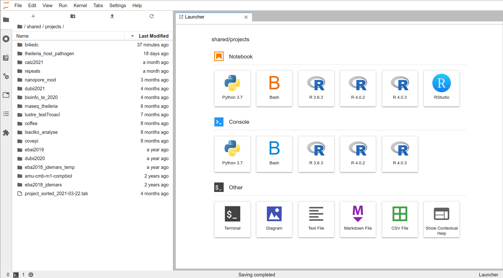

And to go to your project using `cd`.

```
[username @ cpu-node-12 ]$ cd /shared/projects/YourProjectName
```
Now you can clone the repository (use `-b v0.6` to specify the version). You can then look at the files using `tree` or `ls`.
```bash
[username@clust-slurm-client YourProjectName]$ git clone https://github.com/parisepigenetics/RASflow_IFB
Cloning into 'RASflow_IFB'...
Username for 'https://github.com': GITHUBusername
Password for 'https://username@github.com': GITHUBtocken
remote: Enumerating objects: 670, done.
remote: Counting objects: 100% (42/42), done.
remote: Compressing objects: 100% (41/41), done.
remote: Total 670 (delta 1), reused 31 (delta 1), pack-reused 628
Receiving objects: 100% (670/670), 999.24 MiB | 32.76 MiB/s, done.
Resolving deltas: 100% (315/315), done.
Checking out files: 100% (84/84), done.
[username@clust-slurm-client YourProjectName]$ cd RASflow_IFB
[username@clust-slurm-client RASflow_IFB]$ tree -L 2
.
├── cluster.yaml
├── configs
│   ├── config_main.yaml
│   └── metadata.tsv
├── LICENSE
├── main_cluster.py
├── README.md
├── scripts
│   ├── combine2group_genome.py
│   ├── dea_genome.R
│   ├── getquota2.sh
│   ├── mergeCounts.py
│   ├── mergeSummaries.py
│   ├── pca.R
│   ├── reporting.py
│   ├── rmsk2gtf.py
│   ├── TEcount.py
│   ├── TEToolkit
│   └── TEtranscripts_indexer.py
├── StarIndex.sh
├── TestDataset
│   ├── configs
│   ├── gtf
│   ├── hisat2_index
│   └── Raw_fastq
├── Tuto_pictures
│   |-...
├── Unlock.sh
├── workflow
│   ├── align_count_genome.rules
│   ├── dea_genome.rules
│   ├── env.yaml
│   ├── quality_control.rules
│   └── trim.rules
└── Workflow.sh
```

RASflow is launched as a python script named `main_cluster.py` which calls the workflow manager named [Snakemake](https://snakemake.readthedocs.io/en/stable/snakefiles/rules.html). Snakemake will execute rules that are defined in `workflow/xxx.rules` and distribute the corresponding jobs to the computing nodes via [SLURM](https://ifb-elixirfr.gitlab.io/cluster/doc/slurm_user_guide/). 

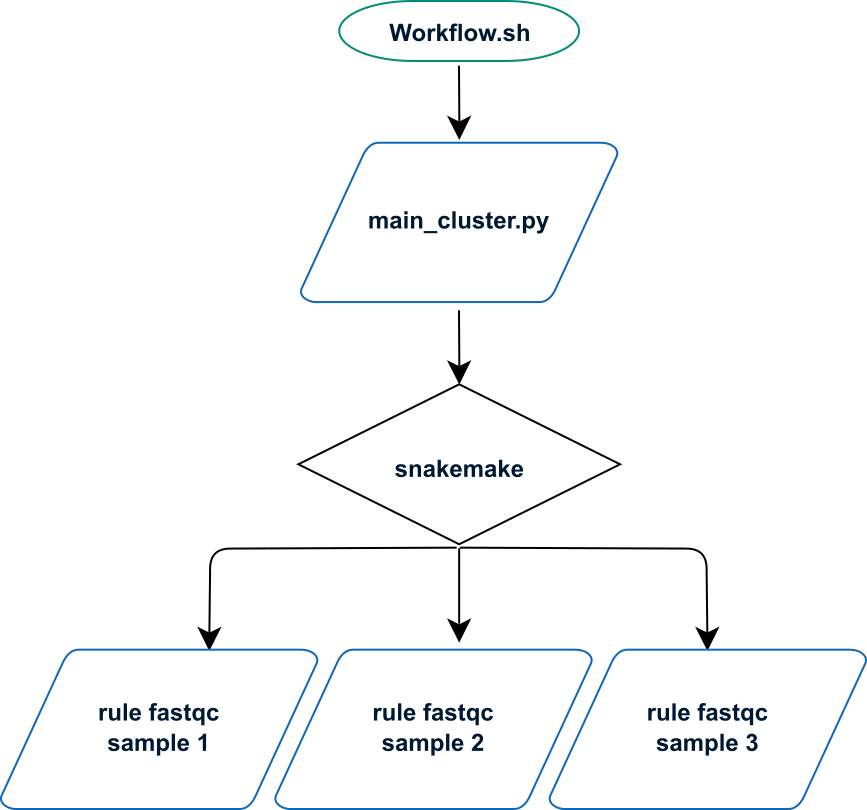


 On the cluster, the main python script is launched via the shell script `Workflow.sh`, which basically contains only one command `python main_cluster.py ifb` (+ information about the run).

----

## Quick start with the test dataset
Before running your analyses you can use the test dataset to make and check your installation. 
First copy the configuration file corresponding to the test. 
```
[username@clust-slurm-client RASflow_IFB]$ cp TestDataset/configs/config_main.yaml configs/
```
Then start the workflow. 
```
[username@clust-slurm-client RASflow_IFB]$ sbatch Workflow.sh
```
**Nota:** The first time you run this command, the Conda environment will be made (see [below](#4-envyaml-facultative)). This takes ~30 min as it dowloads and installs all the tools you'll need. 

This will run the quality control of the raw fastq. See [FASTQ quality control](#fastq-quality-control) for detailed explanations. If everything goes find you will see the results in `TestDataset/results/Test1/fastqc`. See also [how to follow your jobs](#how-to-follow-your-jobs) to know how to check that the run went fine.  
You can now move on with your own data, or run the rest of the workflow on the test dataset. To do so you have to modify `configs/config_main.yaml` turning `QC` entry from "yes" to "no". If you don't know how to do that, see [Preparing the run](#preparing-the-run). Then restart the workflow. 
```
[username@clust-slurm-client RASflow_IFB]$ sbatch Workflow.sh
```
Detailed explanation of the outputs are available in [Workflow results](#workflow-results). 

----

## Transfer your data
You should transfer your data in your project folder `/shared/projects/YourProjectName` before doing your analysis. 

### FASTQ names
The workflow is expecting gzip-compressed FASTQ files with names formatted as   
- `SampleName_R1.fastq.gz` and `SampleName_R2.fastq.gz` for pair-end data, 
- `SampleName.fastq.gz` for single-end data. 

If your files are not fitting this format, please see [how to correct the names of a batch of FASTQ files](#quickly-change-fastq-names). 

### Generate md5sum
It is highly recommended to check the [md5sum](https://en.wikipedia.org/wiki/Md5sum) for big files. If your raw FASTQ files are on your computer in `PathTo/RNAseqProject/Fastq/`, you type in a terminal: 

```
You@YourComputer:~$ cd PathTo/RNAseqProject
You@YourComputer:~/PathTo/RNAseqProject$ md5sum Fastq/* > Fastq/fastq.md5
```

### Copy to the cluster
You can then copy the `Fastq` folder to the cluster using `rsync`, replacing `username` by your IFB login: 

```
You@YourComputer:~/PathTo/RNAseqProject$ rsync -avP  Fastq/ username@core.cluster.france-bioinformatique.fr:/shared/projects/YourProjectName/Raw_fastq
```

In this example the FASTQ files are copied from `PathTo/RNAseqProject/Fastq/` on your computer into a folder named `Raw_fastq` in your project folder on IFB core cluster. Feel free to name your folders as you want! 
You will be asked to enter your password, and then the transfer will begin. If it stops before the end, rerun the last command, it will only add the incomplete/missing files. 

### Check md5sum
After the transfer, [connect to the cluster](#connect-to-ifb-core-cluster) and check the presence of the files in `Raw_fastq` using `ls` or `ll` command. 

```
[username@clust-slurm-client YourProjectName]$ ll Raw_fastq
```

Check that the transfer went fine using md5sum.

```
[username@clust-slurm-client YourProjectName]$ cd Raw_fastq
[username@clust-slurm-client Raw_fastq]$ md5sum -c fastq.md5
```

## Preparing the run

There are **2 files that you have to modify** before running your analysis (`metadata.tsv` and `config_main.yaml` in the `configs` folder), and eventually some others not mandatory. 

To modify the text files from the terminal you can use **vi**, **emacs**, **nano** or **gedit** (the last one being easier to use). **Never copy/past code to word processor** (like Microsoft Word or LibreOffice Writer), use only text editors.  

Nota: in order to use **gedit**, be sure that you included `-X` when connecting to the cluster (`-X` option is necessary to run graphical applications remotely). See [common errors](#error-starting-gedit). 

If you're using the Jupyter Hub, it's **easier** as text and table editors are included, you just have to double click on the file you want to edit, modify and save it using the menu File/Save or Ctrl+S. 

### 1. **metadata.tsv**

The experimental description is set up in `config/metadata.tsv`: 

```
[username@clust-slurm-client RASflow_IFB]$ cat configs/metadata.tsv 
sample	group	subject
D197-D192T27	J0_WT	1
D197-D192T28	J0_WT	2
D197-D192T29	J0_WT	3
D197-D192T30	J0_KO	1
D197-D192T31	J0_KO	2
D197-D192T32	J0_KO	3
D197-D192T33	J10_WT	1
D197-D192T34	J10_WT	2
D197-D192T35	J10_WT	3
D197-D192T36	J10_KO	1
D197-D192T37	J10_KO	2
D197-D192T38	J10_KO	3
```   
**Important:** the columns have to be **tab-separated**.  
On Jupyter Hub:
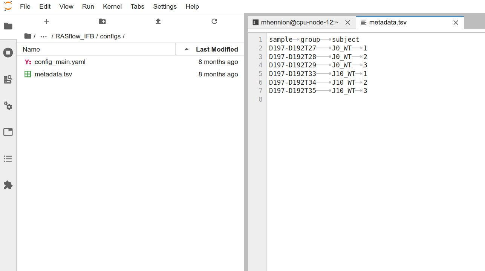

The first column contains the **sample** names that have to **correspond to the FASTQ names** (for instance here D197-D192T27_R1.fastq.gz). The second column describes the **group** the sample belongs to and will be used for differential expression analysis. The last column contains the replicate number or **subject**. If the samples are paired, for instance 2 samples from the same patient taken at different times, the **subject** number should be the same (this information is important for differential expression analysis). You can rename or move that file, as long as you adapt the `METAFILE` entry in `config_main.yaml` (see below).  

### 2. **config_main.yaml**
 
The configuration of the workflow (see [step by step description](#running-your-analysis-step-by-step) below) is done in `config/config_main.yaml`. This is the most important file. It controls the workflow and many tool parameters. It contains 3 parts:  

   1. Define project name and the steps of the workflow you want to run

```yaml
[username@clust-slurm-client RASflow_IFB]$ cat configs/config_main.yaml 
# Please check the parameters, and adjust them according to your circumstance

# Project name
PROJECT: EXAMPLE

# ================== Control of the workflow ==================

## Do you need to do quality control?
QC: yes  # "yes" or "no". If set to "yes", the workflow will stop after the QC to let you decide whether you want to trim your raw data or not. In order to run the rest of the workflow, you have to set it to "no".

## Do you need to do trimming?
TRIMMED: yes  # "yes" or "no"? 

## Do you need to do mapping and feature counting?
MAPPING: yes # "yes" or "no"

## Which mapping reference do you want to use? Genome or transcriptome?
REFERENCE: genome  # "genome" or "transcriptome", I haven't implemented transcriptome yet.

## Do you want to study the repeats?
REPEATS: yes # "yes" or "no"

## Do you want to do Differential Expression Analysis (DEA)?
DEA: yes  # "yes" or "no"
```

**Nota: if `QC` is set to `yes`, the workflow will stop after the QC to let you decide whether you want to trim your raw data or not. In order to run the rest of the workflow, you have to set `QC` to `no`.**  

2. Shared parameters   
Here you define where the FASTQ files are stored, where is the file describing the experimental set up, the name and localization of the folders where the results will be saved. The results (detailed in [Workflow results](#workflow-results)) are separated into two folders:  
- the big files : trimmed FASTQ, bam files are in an specific folder defined at `BIGDATAPATH`
- the small files: QC reports, count tables, BigWig, etc. are in the final result folder defined at `RESULTPATH`  
Examples are given in the configuration file, but you're free to name and organise them as you want. **Be sure to include the full path** (starting from `/`). Here you also precise if your data are paired-end or single-end [Nota: I haven't tested single-end data yet, there might be bugs] and the number of CPUs you want to use for your analysis. 


```yaml
# ================== Shared parameters for some or all of the sub-workflows ==================

## key file if the data is stored remotely, otherwise leave it empty
KEY: 

## the path to fastq files
READSPATH: /shared/projects/YourProjectName/Raw_fastq

## the meta file describing the experiment settings
METAFILE: /shared/projects/YourProjectName/RASflow_IFB/configs/metadata.tsv

## paths for intermediate final results
BIGDATAPATH: /shared/projects/YourProjectName/RASflow_IFB/data # for big files
RESULTPATH: /shared/projects/YourProjectName/RASflow_IFB/results

## is the sequencing paired-end or single-end?
END: pair  # "pair" or "single"

## number of cores you want to allocate to this workflow
NCORE: 24  # Use command "getconf _NPROCESSORS_ONLN" to check the number of cores/CPU on your machine
```

Nota: it is possible to replace all the occurences of `YourProjectName` by your actual project name at once. You can either
- open config_main.yaml in the Jupyter Hub and use `Find...` (Edit menu or Ctrl+F), clicking on the small triangle next to the search bar allows you to replace.
- open config_main.yaml with **gedit** and use `Find and Replace...` (menu or Ctrl+H)
- open with **vi** and type `:%s/YourProjectName/BestProjectEver/g`
- use the command line `sed`

```
[username@clust-slurm-client RASflow_IFB]$ sed -i 's/YourProjectName/BestProjectEver/g' configs/config_main.yaml 
```


3. Configuration of the specific tools  
Here you precise parameters that are specific to one of the steps of the workflow. See detailed description in [step by step analysis](#running-your-analysis-step-by-step).

```yaml
# ================== Configuration for Quality Control ==================

## All required params have already been defined in the public params

# ================== Configuration for trimming ==================

## Number of trimmed bases
## put "no" for TRIM3 and TRIM5 if you don't want to trim a fixed number of bases.
TRIM5: no #  integer or "no", remove N bp from the 5' end of reads. This may be useful if the qualities were very poor, or if there is some sort of unwanted bias at the 5' end. 
TRIM3: no # integer or "no", remove N bp from the 3' end of reads AFTER adapter/quality trimming has been performed.

# ================== Configuration for quantification using transcriptome ==================

## transcriptome file
TRANS: /shared/.. # not yet implemented

# ================== Configuration for alignment to genome and feature count ==================

## aligner
ALIGNER: HISAT2 # "STAR" or "HISAT2"

## genome and annotation files
INDEXPATH: /shared/bank/homo_sapiens/hg38/hisat2 # folder containing index files
INDEXBASE: genome # for hisat2, base of the name of the index files (ie genome.1.ht2)
ANNOTATION: /shared/projects/YourProjectName/RASflow_IFB/gtf/gencode.v34.annotation.gtf # GTF file  

## bigwig option
BWSTRANDED: both # "no": bw merging forward and reverse reads, "yes": get 2 bw files, one forward and one reverse; "both": get the two bw per strand as well as the merge one. 

## tool for feature count
COUNTER: featureCounts # "featureCounts" or "htseq-count" or "STARcount" (only with STAR aligner, --quantMode GeneCounts option) or "TEcount" (if REPEATS: yes)

## counting options
[...]
```

### 3. **Workflow.sh** [Facultative] 

In `Workflow.sh`, you can modify the **Job name** and the **Output** folder to save SLURM outputs. If you don't change this file, SLURM outputs will be saved in a `slurm_output` folder that will be created in your working directory. The line is read if it starts with one `#` and is not used if it starts with 2 (or more) `#`. For instance here

```bash
[username@clust-slurm-client RASflow_IFB]$ cat Workflow.sh
#!/bin/bash

################################ Slurm options #################################

### Job name 
##SBATCH --job-name=RASflow 

### Output
##SBATCH --output=RASflow-%j.out
[...]
```

the default names `slurm-xxx` will be used, whereas here

```bash
#!/bin/bash

################################ Slurm options #################################

### Job name 
#SBATCH --job-name=RASflow 

### Output
#SBATCH --output=TheFolderIwant/RASflow-%j.out
[...]
```

the job name will be `RASflow` and SLURM output (only for the snakemake commands, not for the jobs launched by snakemake) will go to `TheFolderIwant/RASflow-%j.out`.

### 4. **env.yaml** [Facultative]

RASflow relies on a Conda environment, you can check the version of the tools (and eventually modify them) in `workflow/env.yaml`. Note that conflicts between versions are frequent and might be tricky to solve. 

```yaml
name: rasflow_IFB 
channels:
  - conda-forge
  - bioconda
  - r
  - defaults
dependencies:
# conda-forge channel installs
  - R=4.0
  - python=3.7.6
  - graphviz=2.42.3
  - r-yaml=2.2.1
  - r-statmod=1.4.34
  - r-gplots=3.0.3
  - r-magick=2.3
  - r-dt=0.13
  - r-sessioninfo=1.1.1
  - r-knitr=1.29
  - r-heatmap.plus=1.3
  - r-readr=1.3.1
  - r-hash=3.0.1
  - r-pheatmap=1.0.12
  - r-rcolorbrewer=1.1_2
  - imagemagick=7.0.10
# bioconda channel installs
  - snakemake=5.14.0
  - fastqc=0.11.9
  - trim-galore=0.6.5
  - multiqc=1.9
  - salmon=1.2.1
  - hisat2=2.2.0
  - star=2.7.5a
  - samtools=1.10
  - subread=2.0.1  # featureCounts included
  - htseq=0.12.4  # htseq-count included
  - bioconductor-edger=3.30.0
  - bioconductor-deseq2=1.28.0
  - qualimap=2.2.2a
  - bioconductor-mygene=1.24.0
  - bioconductor-tximport=1.16.0
  - bioconductor-enhancedvolcano=1.6.0
  - bioconductor-biomart=2.44.0
  - deeptools=3.4.3
  - bioconductor-regionreport=1.22.0
  - bioconductor-glimma=1.16.0
  - pysam=0.16.0 
  - picard=2.25.5
```

## Running the workflow
When the configuration files are ready, you can start the run by `sbatch Workflow.sh`.

```
[username@clust-slurm-client RASflow_IFB]$ sbatch Workflow.sh
```

Please see below detailed explanation. 

---------------

## Running your analysis step by step

### FASTQ quality control

Prerequisite:   
- Your FASTQ files are on the cluster, in our example in `/shared/projects/YourProjectName/Raw_fastq` (but you can name your folders as you want, as long as you adjust the `READSPATH` parameter in `config_main.yaml`). 
- You have modified `config/metadata.tsv` according to your experimental design.

Now you have to check in `config/config_main.yaml` that: 

- you gave a project name

```yaml
# Project name
PROJECT: EXAMPLE
```

- In `Control of the workflow`, QC is set to `yes`: 

```yaml
# ================== Control of the workflow ==================
## Do you need to do quality control?
QC: yes  # "yes" or "no". If set to "yes", the workflow will stop after the QC to let you decide whether you want to trim your raw data or not. In order to run the rest of the workflow, you have to set it to "no".
```

The rest of the part `Control of the workflow` will be **ignored**. The software will stop after the QC to give you the opportunity to decide if trimming is necessary or not. 

- The shared parameters are correct (paths to the FASTQ files, metadata.tsv, result folders, single or paired-end data). 

```yaml
## the path to fastq files
READSPATH: /shared/projects/YourProjectName/Raw_fastq

## the meta file describing the experiment settings
METAFILE: /shared/projects/YourProjectName/RASflow_IFB/configs/metadata.tsv

## paths for intermediate and final results
BIGDATAPATH: /shared/projects/YourProjectName/RASflow_IFB/data # for big files
RESULTPATH: /shared/projects/YourProjectName/RASflow_IFB/results

## is the sequencing paired-end or single-end?
END: pair  # "pair" or "single"

## number of cores you want to allocate to this workflow
NCORE: 24  # Use command "getconf _NPROCESSORS_ONLN" to check the number of cores/CPU on your machine
```

When this is done, you can start the QC by running:

```
[username@clust-slurm-client RASflow_IFB]$ sbatch Workflow.sh
```

Nota: The first time you run this command, the Conda environment will be made. This takes ~30 min as it dowloads and installs all the tools you'll need. 

You can check if your job is running using squeue.

```
[username@clust-slurm-client RASflow_IFB]$ squeue -u username
```

You should also check SLURM output files. 

### Description of the log files 

The first job is the main script. This job will call one or several snakefiles (`.rules` files) that define small workflows of the individual steps. There are SLURM outputs at the 3 levels. 
1. [Main script](#1-main-script)
2. [Snakefiles](#2-snakefiles)
3. [Individual tasks](#3-individual-tasks)

The configuration of the run and the timing are also saved:

4. [Configuration and timing](#4-configuration-and-timing)

Where to find those outputs and what do they contain?

#### 1. **Main script**

 The output is in `slurm_output` (default) or in the specified folder if you modified `Workflow.sh`. It contains global information about your run. 
Typically the main job output looks like :

```
[username@clust-slurm-client RASflow_IFB]$ cat slurm_output/RASflow-13350656.out 
########################################
Date: 2020-09-25T10:57:14+0200
User: mhennion
Host: cpu-node-60
Job Name: RASflow
Job Id: 13350656
Directory: /shared/projects/bi4edc/RASflow_IFB
########################################
RASflow_IFB version: v0.4
-------------------------
Main module versions:
conda 4.8.4
Python 3.8.3
snakemake
5.19.2
-------------------------
PATH:
/shared/software/miniconda/envs/snakemake-5.19.2/bin:/shared/software/miniconda/bin:/shared/mfs/data/software/miniconda/bin:/shared/mfs/data/software/miniconda/condabin:/shared/software/sinteractive:/shared/software/modules/4.1.4/bin:/usr/local/bin:/usr/bin:/usr/local/sbin:/usr/sbin:/opt/go/1.14.4/bin:/opt/go/packages/bin:/shared/home/mhennion/.local/bin:/shared/home/mhennion/bin
-------------------------
Is quality control required?
 no
Is trimming required?
 yes
Is mapping required?
 yes
Which mapping reference will be used?
 genome
Is DEA required?
 yes
Start RASflow on project: TIMING
Start Trimming!
Trimming is done! (0:00:18)
Start mapping using  genome  as reference!
Mapping is done! (0:01:51)
Start doing DEA!
DEA is done! (0:00:17)
RASflow is done!
########################################
---- Errors ----
There were no errors ! It's time to look at your results, enjoy!
########################################
Job finished 2020-09-25T11:06:50+0200
---- Total runtime 576 s ; 9 min ----
```
You can see at the end if this file if an error occured during the run. See [Errors](#having-errors).

#### 2. **Snakefiles**
 There are 4 snakefiles (visible in the `workflow` folder) that correspond to the different steps of the analysis:
  - quality_control.rules (QC)
  - trim.rules (reads trimming/filtering)
  - align_count_genome.rules (mapping and counting)
  - dea_genome.rules (differential gene expression)

The SLURM outputs of those different steps are stored in the `logs` folder and named as the date plus the corresponding snakefile: for instance
`20200615T1540_trim.txt` or  `20200615T1540_align_count_genome.txt`. 

Here is a description of one of those files (splitted): 

---
- Building the DAG (directed acyclic graph): Define the jobs that will be launched and in which order.

```
Building DAG of jobs...
Using shell: /usr/bin/bash
Provided cluster nodes: 30
Job counts:
	count	jobs
	1	all
	1	getReads
	1	summaryReport
	1	trim
	1	trimstart
	5
```

- Start the first job (or jobs if there are several independant jobs). The rule is indicated, with the expected outputs. For the first steps one job is started per sample. 

```
[Tue May 12 17:48:20 2020]
rule getReads:
    output: /shared/projects/lxactko_analyse/RASflow/data/LXACT_1-test/trim/reads/Test_forward.fastq.gz, /shared/projects/lxactko_analyse/RASflow/data/LXACT_1-test/trim/reads/Test_reverse.fastq.gz
    jobid: 4
    wildcards: sample=Test

Submitted DRMAA job 4 with external jobid 7908074.
```

You have here the corresponding **job ID**. You can follow that particular job in `slurm-7908074.out`. 

- End of that job, start of the next one:

```
[Tue May 12 17:48:30 2020]
Finished job 4.
1 of 5 steps (20%) done

[Tue May 12 17:48:30 2020]
rule trimstart:
    input: /shared/projects/lxactko_analyse/RASflow/data/LXACT_1-test/trim/reads/Test_forward.fastq.gz, /shared/projects/lxactko_analyse/RASflow/data/LXACT_1-test/trim/reads/Test_reverse.fastq.gz
    output: /shared/projects/lxactko_analyse/RASflow/data/LXACT_1-test/trim/Test_forward.91bp_3prime.fq.gz, /shared/projects/lxactko_analyse/RASflow/data/LXACT_1-test/trim/Test_reverse.91bp_3prime.fq.gz
    jobid: 3
    wildcards: sample=Test

Submitted DRMAA job 3 with external jobid 7908075.
```

- At the end of the job, it removes temporary files if any:

```
Removing temporary output file /shared/projects/lxactko_analyse/RASflow/data/LXACT_1-test/trim/reads/Test_forward.fastq.gz.
Removing temporary output file /shared/projects/lxactko_analyse/RASflow/data/LXACT_1-test/trim/reads/Test_reverse.fastq.gz.
[Tue May 12 17:49:10 2020]
Finished job 3.
2 of 5 steps (40%) done
```

- And so on... Finally:

```
[Tue May 12 17:51:10 2020]
Finished job 0.
5 of 5 steps (100%) done
Complete log: /shared/mfs/data/projects/lxactko_analyse/RASflow/.snakemake/log/2020-05-12T174816.622252.snakemake.log
```

---

#### 3. **Individual tasks**
Every job generate a `slurm-JOBID.out` file. It is localised in the working directory as long as the workflow is running. It is then moved to the `slurm_output` folder. SLURM output specifies the rule, the sample (or samples) involved, and gives outputs specific to the tool:  

```
[username@clust-slurm-client RASflow_IFB]$ cat slurm_output/slurm-8080372.out 
Building DAG of jobs...
Using shell: /usr/bin/bash
Provided cores: 32
Rules claiming more threads will be scaled down.
Job counts:
	count	jobs
	1	trimstart
	1

[Fri May 15 10:51:03 2020]
rule trimstart:
    input: /shared/projects/lxactko_analyse/RASflow/data/LXACT_1-test/trim/reads/Test_forward.fastq.gz, /shared/projects/lxactko_analyse/RASflow/data/LXACT_1-test/trim/reads/Test_reverse.fastq.gz
    output: /shared/projects/lxactko_analyse/RASflow/data/LXACT_1-test/trim/Test_forward.91bp_3prime.fq.gz, /shared/projects/lxactko_analyse/RASflow/data/LXACT_1-test/trim/Test_reverse.91bp_3prime.fq.gz
    jobid: 0
    wildcards: sample=Test

Activating conda environment: /shared/mfs/data/projects/lxactko_analyse/RASflow/.snakemake/conda/ce003734

[...SOME OUTPUT DEPENDANT ON THE TOOL ...]

[Fri May 15 10:52:30 2020]
Finished job 0.
1 of 1 steps (100%) done
```
#### 4. **Configuration and timing**

Three extra files can be found in the `logs` folder:

- A log file named `20200615T1540_running_time.txt` stores **running times.**  

```
[username@clust-slurm-client RASflow_IFB]$ cat logs/20200615T1540_running_time.txt 

Project name: EXAMPLE
Start time: Mon Jun 15 15:40:13 2020
Time of running trimming: 0:00:12
Time of running genome alignment: 0:08:43
Time of running DEA genome based: 0:01:32
Finish time: Mon Jun 15 15:50:43 2020
```

- A log file named `20200925T1057_configuration.txt` keeps a track of the **configuration of the run** (`config_main.yaml` followed by `metadata.tsv`, conda environment `env.yaml` and cluster configuration `cluster.yaml`)
```yaml
[username@clust-slurm-client RASflow_IFB]$: cat logs/20200925T1057_configuration.txt 
 
# Please check the parameters, and adjust them according to your circumstance

# Project name
PROJECT: TIMING

# ================== Control of the workflow ==================

[...]
MAINPATH: "" # leave "" empty for IFB core cluster, "/scratch/epigenetique/workflows/RASflow_RPBS/" for RPBS cluster.

==========================================

SAMPLE PLAN
sample	group	subject
D197-D192T27	J0_WT	1
D197-D192T28	J0_WT	2
D197-D192T29	J0_WT	3
D197-D192T30	J0_KO	1
D197-D192T31	J0_KO	2
D197-D192T32	J0_KO	3
D197-D192T33	J10_WT	1
D197-D192T34	J10_WT	2
D197-D192T35	J10_WT	3
D197-D192T36	J10_KO	1
D197-D192T37	J10_KO	2
D197-D192T38	J10_KO	3

==========================================

CONDA ENV

name: rasflow_IFB 
channels:
  - conda-forge
  - bioconda
  - r
  - defaults
dependencies:
# conda-forge channel installs
  - R=4.0
  - python=3.7.6
  - graphviz=2.42.3
  - r-yaml=2.2.1
  - r-statmod=1.4.34
[...]

==========================================

CLUSTER

__default__:
  mem: 500
  name: snakejob
  cpus: 1

qualityControl:
  mem: 6000
  name: QC
  cpus: 2
[...]
```
- A log file named `20200925T1057_free_disk.txt` stores the disk usage during the run (every minute, the remaining space is measured). 
```
# quota:b'1 limit:1.5
time	free_disk
20210726T1611	661
20210726T1612	660
20210726T1613	660
20210726T1614	660
20210726T1615	660
20210726T1616	660
```
If a run stops with no error, it can be that you don't have enough space in your IFB project. You can see in this file that the free disk tends to 0. 


### FastQC results

If everything goes fine, fastQC results will be in `results/EXAMPLE/fastqc/`. For every sample you will have something like:

```
[username@clust-slurm-client RASflow_IFB]$ ll results/EXAMPLE/fastqc
total 38537
-rw-rw----+ 1 username username  640952 May 11 15:16 Sample1_forward_fastqc.html
-rw-rw----+ 1 username username  867795 May 11 15:06 Sample1_forward_fastqc.zip
-rw-rw----+ 1 username username  645532 May 11 15:16 Sample1_reverse_fastqc.html
-rw-rw----+ 1 username username  871080 May 11 15:16 Sample1_reverse_fastqc.zip
```

Those are individual fastQC reports. [MultiQC](https://multiqc.info/docs/) is called after FastQC, so you will also find `report_quality_control.html` that is a summary for all the samples. 
You can copy those reports to your computer by typing (in a new local terminal):

```
You@YourComputer:~$ scp -pr username@core.cluster.france-bioinformatique.fr:/shared/projects/YourEXAMPLE/RASflow_IFB/results/EXAMPLE/fastqc PathTo/WhereYouWantToSave/
```
or look at them directly in the Jupyter Hub.  
It's time to decide if you need trimming or not. 
If you have no sequence bias, and little amount of adapters, trimming is not necessary and you can proceed directly to the [mapping step](#mapping-and-counting).

---

**In principle you can now run all the rest of the pipeline at once. To do so you have set QC to "no" and to configure the other parts of `config_main.yaml`.** 

---

### Trimming
If you put `TRIMMED: no`, there will be no trimming and the original FASTQ sequences will be mapped. 

If you put `TRIMMED: yes`, [Trim Galore](https://github.com/FelixKrueger/TrimGalore/blob/master/Docs/Trim_Galore_User_Guide.md) will remove low quality and very short reads, and cut the adapters. If you also want to remove a fixed number of bases in 5' or 3', you have to configure it. For instance if you want to remove the first 10 bases: 

```yaml
# ================== Control of the workflow ==================

## Do you need to do quality control?
QC: no  # "yes" or "no". If set to "yes", the workflow will stop after the QC to let you decide whether you want to trim your raw data or not. In order to run the rest of the workflow, you have to set it to "no".

## Do you need to do trimming?
TRIMMED: "yes"  # "yes" or "no"?  
[...]
# ================== Configuration for trimming ==================

## Number of trimmed bases
## put "no" for TRIM3 and TRIM5 if you don't want to trim a fixed number of bases.
TRIM5: 10 #  integer or "no", remove N bp from the 5' end of reads. This may be useful if the qualities were very poor, or if there is some sort of unwanted bias at the 5' end. 
TRIM3: no # integer or "no", remove N bp from the 3' end of reads AFTER adapter/quality trimming has been performed. 
```

### Mapping and counting

At this step you have to choose the aligner you want ([HISAT2](http://daehwankimlab.github.io/hisat2/manual/) or [STAR](https://github.com/alexdobin/STAR/blob/master/doc/STARmanual.pdf)), to provide the path to corresponding genome index as well as to a GTF annotation file. 
Some reference files are shared between cluster users. Before downloading a new reference, check what is available at `/shared/bank/`. 

```bash
[username@clust-slurm-client ~]$ tree -L 2 /shared/bank/homo_sapiens/
/shared/bank/homo_sapiens/
├── GRCh37
│   ├── bowtie2
│   ├── fasta
│   ├── gff
│   ├── star -> star-2.7.2b
│   ├── star-2.6
│   └── star-2.7.2b
├── GRCh38
│   ├── bwa
│   ├── fasta
│   ├── gff
│   ├── star -> star-2.6.1a
│   └── star-2.6.1a
├── hg19
│   ├── bowtie
│   ├── bowtie2
│   ├── bwa
│   ├── fasta
│   ├── gff
│   ├── hisat2
│   ├── picard
│   ├── star -> star-2.7.2b
│   ├── star-2.6
│   └── star-2.7.2b
└── hg38
    ├── bowtie2
    ├── fasta
    ├── star -> star-2.7.2b
    ├── star-2.6
    └── star-2.7.2b

30 directories, 0 files
```

If you don't find what you need, you can ask for it on [IFB community support](https://community.france-bioinformatique.fr/). In case you don't have a quick answer, you can download (for instance [here](http://refgenomes.databio.org/)) or produce the indexes you need in your folder (and remove it when it's available in the common banks). 

**HISAT2 indexes** can be found [here](http://daehwankimlab.github.io/hisat2/download/). Right click on the file you need and copy the link. Then paste the link to `wget`. When downloading is over, you have to decompress the file. 

```
[username@clust-slurm-client RASflow_IFB]$ wget https://cloud.biohpc.swmed.edu/index.php/s/hg38/download
--2020-05-25 11:03:21--  https://cloud.biohpc.swmed.edu/index.php/s/hg38/download
Resolving cloud.biohpc.swmed.edu (cloud.biohpc.swmed.edu)... 129.112.9.92
Connecting to cloud.biohpc.swmed.edu (cloud.biohpc.swmed.edu)|129.112.9.92|:443... connected.
HTTP request sent, awaiting response... 200 OK
Length: 4355786349 (4,1G) [application/x-gzip]
Saving to: ‘download’

100%[==========================================================================================================================>] 4 355 786 349 24,6MB/s   in 2m 51s 

2020-05-25 11:06:13 (24,3 MB/s) - ‘download’ saved [4355786349/4355786349]
[username@clust-slurm-client index]$ mv download hg38.tar.gz
[username@clust-slurm-client index]$ tar -zxvf hg38.tar.gz 
```

**STAR indexes** depend on STAR version. STAR 2.7.5a is used here, the indexes should be made with version 2.7.5a or 2.7.4a to be compatible. If you don't find the indexes you need, you can generate them from your genome FASTA. To do so, you can run `StarIndex.sh` giving the path to your genome FASTA file (here `/shared/bank/homo_sapiens/hg38/fasta/hg38.fa` and to the output directory where the index will be saved (here `index/STAR_2.7.5a/hg38`). 

```
[username@clust-slurm-client RASflow_IFB]$ sbatch StarIndex.sh /shared/bank/homo_sapiens/hg38/fasta/hg38.fa index/STAR_2.7.5a/hg38
```

**GTF** files can be downloaded from [GenCode](https://www.gencodegenes.org/) (mouse and human), [ENSEMBL](https://www.ensembl.org/info/data/ftp/index.html), [NCBI](https://www.ncbi.nlm.nih.gov/assembly/) (RefSeq, help [here](https://www.ncbi.nlm.nih.gov/genome/doc/ftpfaq/#files)), ...
Similarly you can dowload them to the server using `wget`. 

Don't hesitate to give the links to the new references you made/downloaded to [IFB community support](https://community.france-bioinformatique.fr/) so that they can add them to the common banks. 

Be sure you give the right path to those files and adjust the other settings to your need: 


```yaml
# ================== Control of the workflow ==================
[...]
## Which mapping reference do you want to use? Genome or transcriptome?
REFERENCE: genome  # "genome" or "transcriptome", I haven't implemented transcriptome yet. 

[...]
# ================== Configuration for alignment to genome and feature count ==================

## aligner
ALIGNER: HISAT2 # "STAR" or "HISAT2"

## genome and annotation files
INDEXPATH: /shared/bank/homo_sapiens/hg38/hisat2 # folder containing index files
INDEXBASE: genome  # base of the name of the index files (ie genome.1.ht2)
ANNOTATION: /shared/projects/YourProjectName/RASflow_IFB/gtf/gencode.v34.annotation.gtf # GTF file

## bigwig option
BWSTRANDED: both # "no": bw merging forward and reverse reads, "yes": get 2 bw files, one forward and one reverse; "both": get the two bw per strand as well as the merge one. 

## tool for feature count
COUNTER: featureCounts # "featureCounts" or "htseq-count" or "STARcount" (only with STAR aligner, --quantMode GeneCounts option) or "TEcount" (if REPEATS: yes)

## counting options
COUNTOPTIONS: "-O --fraction" # add extra options for the counter (for featureCounts or htseq-count only). 
# featureCounts: '-O' (set allowMultiOverlap to TRUE), '-M' (set countMultiMappingReads to TRUE), '--fraction'.
# htseq-count: -m <mode> ; --nonunique=<nonunique mode>; ... see https://htseq.readthedocs.io
ATTRIBUTE: gene_id  # the attribute used in annotation file. It's usually "gene_id", but double check that since it may also be "gene", "ID"...
STRAND: reverse # "no", "yes", "reverse". For stranded=no, a read is considered overlapping with a feature regardless of whether it is mapped to the same or the opposite strand as the feature. For stranded=yes and single-end reads, the read has to be mapped to the same strand as the feature. For paired-end reads, the first read has to be on the same strand and the second read on the opposite strand. For stranded=reverse, these rules are reversed.
FEATURE: transcript # "exon", "gene", "transcript", ... depending on your GTF file and on the feature you're interested in. 
```

For an easy visualisation on a genome browser, BigWig files are generated. You can choose if you want to separate forward and reverse reads setting `BWSTRANDED`. 

If you use STAR, count tables are generated during the mapping step (`with --quantMode GeneCounts option`). If you want to use them for DEA, you have to set `COUNTER` to STARcount. 

Two other counters are available: 
- [HTseq-count](https://htseq.readthedocs.io/en/master/count.html) 

- featureCounts ([SubReads package](http://subread.sourceforge.net/)) 

Both are running with default parameters unless you add parameters in `COUNTOPTIONS`. 

Beside the methode that is a bit different, TO COMPLETE
difference in time
difference in storage space

As at the moment the default projet quota in 500 Go you might be exceeding the space you have (and may or may not get error messages...). So if featureCounts fails, try removing files to get more space, or ask to increase your quota on [Community support](https://community.cluster.france-bioinformatique.fr). To see the space you have you can run:

``` 
[username@clust-slurm-client RASflow_IFB]$ du -h --max-depth=1 /shared/projects/YourProjectName/
```

and

```
[username@clust-slurm-client RASflow_IFB]$ lfsgetquota YourProjectName
```

### Repeats analysis
It is possible to analyse the repeat expression. To do so, you have to set `REPEATS` to `yes` in config_main.yaml and to choose an appropriate counter, ie featureCounts or TEcount (from [TEtranscripts](https://github.com/mhammell-laboratory/TEtranscripts)). You also have to give the path to the GTF of the repeats. You can make it using http://genome.ucsc.edu/cgi-bin/hgTables. 

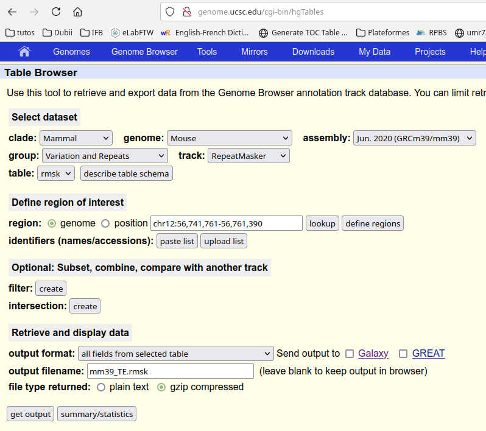

You have to download the table and to copy it to the cluster (or upload it directly into the Jupyter Hub). For instance: 
```sh
You@YourComputer:~$ scp mm39_TE.rmsk.gz username@core.cluster.france-bioinformatique.fr:/shared/projects/YourProjectName/RASflow_IFB/
```
Then you decompress it on the cluster. 
```sh
[username@clust-slurm-client RASflow_IFB]$ mkdir gtf  # create a folder
[username@clust-slurm-client RASflow_IFB]$ mv mm39_TE.rmsk.gz gtf # mv your rmsk file into the folder gtf
[username@clust-slurm-client RASflow_IFB]$ cd gtf # go to gtf folder
[username@clust-slurm-client gtf]$ gzip -d mm39_TE.rmsk.gz # decompress the file
```
A small script is available to transform this table into a GTF.
```
[username@clust-slurm-client gtf]$ module load python
[username@clust-slurm-client gtf]$ python ../scripts/rmsk2gtf.py mm39_TE.rmsk mm39_TE_rmsk.gtf transcript
```
The last argument (here `transcript`) should fit the feature you have choosen for counting: 
```yaml
FEATURE: transcript # "exon", "gene", "transcript", ... depending on your GTF file and on the feature you're interested in.
```
You can then give the path to your repeat GTF in the configuration file.
```yaml
# ================== Configuration for repeat analysis ==================

GTFTE: /shared/projects/YourProjectName/RASflow_IFB/gtf/mm39_TE_rmsk.gtf  # GTF ANNOTATION file for repeats, must be adapted to have the FEATURE you chose ("exon", "gene", "transcript") as 3rd column. 
```


### Differential expression analysis and visualization

Finally you have to set the parameters for the differential expression analysis. You have to define the comparisons you want to do (pairs of conditions) and to choose if you want to use [edgeR](https://bioconductor.org/packages/release/bioc/manuals/edgeR/man/edgeR.pdf) or [DESeq2](https://bioconductor.org/packages/release/bioc/manuals/DESeq2/man/DESeq2.pdf).

```yaml
# ================== Configuration for DEA ==================

## Do you want to use edgeR or DESeq2 to do DEA?
DEATOOL: edgeR  # "edgeR" or "DESeq2"? DESeq2 is recommended for transcriptome-based DEA

## Is your experiment designed in a pair-wise way?
PAIR: no  # Is this a pair test or not? (yes or no). For instance 2 samples from the same patient taken at different times.

## the comparison(s) you want to do. If multiple comparisons, specify each pair (CONTROL & TREAT) in order respectively
CONTROL: ["J0_WT","J0_WT","J10_WT","J0_KO"]
TREAT: ["J0_KO","J10_WT","J10_KO","J10_KO"]
## length of 'CONTROL' should agree with that of 'TREAT'
## what you fill in there should agree with the "group" column in metadata.tsv

FILTER: yes  # Filter out low expressed transcripts/genes or not? (yes or no). It's generally  better to be set to "yes".
```

When this file is fully adapted to your experimental set up and needs, you can start the workflow by running:

```
[username@clust-slurm-client RASflow_IFB]$ sbatch Workflow.sh
```

---

## Workflow results

The results are separated into two folders : 
- the big files : trimmed FASTQ and bam files are in the data folder defined in `configs/config_main.yaml` at `BIGDATAPATH`

```yaml
## paths for intermediate and final results
BIGDATAPATH: /shared/projects/YourProjectName/RASflow_IFB/data # for big files
```

```
[username@clust-slurm-client RASflow_IFB]$ tree -L 2 data/EXAMPLE/
data/EXAMPLE/
└── mapping_HISAT2
    ├── bam_byName
    ├── benchmarks
    ├── reads
    ├── Sorted_bam
    └── splicesites.txt
└── trim
    ├── D197-D192T27_forward.91bp_3prime.fq.gz_trimming_report.txt
    ├── D197-D192T27_R1_trimmed_fastqc.html
    ├── D197-D192T27_R1_trimmed_fastqc.zip
    ├── D197-D192T27_R1_trimmed.fq.gz
    ...
```

- the small files: QC reports, count tables, BigWig, DEA reports, etc. are in the final result folder defined in `configs/config_main.yaml` at `RESULTPATH`

```yaml
RESULTPATH: /shared/projects/YourProjectName/RASflow_IFB/results
```

```bash
[username@clust-slurm-client RASflow_IFB]$ tree -L 2 results/EXAMPLE/
├── 20210727T1030_report.html
├── 20210727T1030_report.tar.bz2
├── logs
│   ├── 20210727T1030_align_count_genome.txt
│   ├── 20210727T1030_configuration.txt
│   ├── 20210727T1030_dea_genome.txt
│   ├── 20210727T1030_free_disk.txt
│   └── 20210727T1030_running_time.txt
└── mapping_HISAT2
    ├── alignmentQC
    ├── bw_str
    ├── counting_featureCounts
    ├── repeats_featureCounts
    ├── report_align_count_featureCounts_data
    └── report_align_count_featureCounts.html
```

This way you can **get all the results** on your computer by running (from your computer):

```
You@YourComputer:~$ scp -pr username@core.cluster.france-bioinformatique.fr:/shared/projects/YourProjectName/RASflow_IFB/results/EXAMPLE/ PathTo/WhereYouWantToSave/
```

and the huge files will stay on the server. You can of course download them as well if you have space (and this is recommended for the long term). 

### Final report
A report named as `20210727T1030_report.html` summarizes your experiment and your results. You'll find links to fastQC results, to mapping quality report, to exploratory analysis of all the samples and finally to pairwise differential expression analyses. Interactive plots are included in the report. They are very helpful to dig into the results. A compressed archive names `report.tar.bz2` is also generated and contains the report and the targets of the different links, excluding the count and DEA tables to make it small enough to be sent to your collaborators. An example of report is visible [here](https://parisepigenetics.github.io/umr7216bioinfofacility/pages/report/report.html). 

Detailed description of all the outputs of the workflow is included below. 

### Trimmed reads
After trimming, the FASTQ are stored in the data folder defined in `configs/config_main.yaml` at `BIGDATAPATH:`. 

In this examples the trim FASTQ files will be stored in `/shared/projects/YourProjectName/RASflow_IFB/data/EXAMPLE/trim/`. They are named
- Sample1_R1_val_1.fq
- Sample1_R2_val_2.fq

#### Trimming report
In `results/EXAMPLE/trimming` you'll find trimming reports such as `Sample1_forward.fastq.gz_trimming_report.txt` for each samples. You'll find information about the tools and parameters, as well as trimming statistics:

```
SUMMARISING RUN PARAMETERS
==========================
Input filename: data/Trim/trimming/reads/D197-D192T27_reverse.fastq.gz
Trimming mode: paired-end
Trim Galore version: 0.6.4_dev
Cutadapt version: 3.4
Python version: could not detect
Number of cores used for trimming: 4
Quality Phred score cutoff: 20
Quality encoding type selected: ASCII+33
Using Illumina adapter for trimming (count: 6420). Second best hit was smallRNA (count: 181)
Adapter sequence: 'AGATCGGAAGAGC' (Illumina TruSeq, Sanger iPCR; auto-detected)
Maximum trimming error rate: 0.1 (default)
Minimum required adapter overlap (stringency): 1 bp
Minimum required sequence length for both reads before a sequence pair gets removed: 20 bp
Running FastQC on the data once trimming has completed
Output file will be GZIP compressed


This is cutadapt 3.4 with Python 3.7.6
Command line parameters: -j 4 -e 0.1 -q 20 -O 1 -a AGATCGGAAGAGC data/Trim/trimming/reads/D197-D192T27_reverse.fastq.gz
Processing reads on 4 cores in single-end mode ...
Finished in 10.61 s (10 µs/read; 5.94 M reads/minute).

=== Summary ===

Total reads processed:               1,049,477
Reads with adapters:                   369,439 (35.2%)
Reads written (passing filters):     1,049,477 (100.0%)

Total basepairs processed:   105,997,177 bp
Quality-trimmed:                 282,956 bp (0.3%)
Total written (filtered):    104,983,243 bp (99.0%)

=== Adapter 1 ===

Sequence: AGATCGGAAGAGC; Type: regular 3'; Length: 13; Trimmed: 369439 times

No. of allowed errors:
1-9 bp: 0; 10-13 bp: 1

Bases preceding removed adapters:
  A: 30.0%
  C: 31.9%
  G: 25.2%
  T: 12.9%
  none/other: 0.0%

Overview of removed sequences
length	count	expect	max.err	error counts
1	240511	262369.2	0	240511
2	79277	65592.3	0	79277
3	26294	16398.1	0	26294
[...]

RUN STATISTICS FOR INPUT FILE: data/Trim/trimming/reads/D197-D192T27_reverse.fastq.gz
=============================================
1049477 sequences processed in total

Total number of sequences analysed for the sequence pair length validation: 1049477

Number of sequence pairs removed because at least one read was shorter than the length cutoff (20 bp): 532 (0.05%)
```

This information is summarized in the MultiQC report, see  below. 

#### FastQC of trimmed reads
After the trimming, fastQC is automatically run on the new FASTQ and the results are also in the folder `results/EXAMPLE/fastqc_after_trimming/`:
- Sample1_R1_trimmed_fastqc.html
- Sample1_R1_trimmed_fastqc.zip
- Sample1_R2_trimmed_fastqc.html
- Sample1_R2_trimmed_fastqc.zip

As previously **MultiQC** gives a summary for all the samples :  `results/EXAMPLE/fastqc_after_trimming/report_quality_control_after_trimming.html`. You'll find information from the trimming report (for instance you can rapidly see the % of trim reads for the different samples) as well as from fastQC. It is included in the final report (ie `20210727T1030_report.html`). 

### Mapped reads
The mapped reads are stored as sorted bam in the data folder, in our example in `data/EXAMPLE/mapping_ALIGNER/Sorted_bam`, together with their `.bai` index. They can be visualized using a genome browser such as [IGV](http://software.broadinstitute.org/software/igv/home) but this is not very convenient as the files are heavy. [BigWig](https://deeptools.readthedocs.io/en/develop/content/tools/bamCoverage.html) files, that summarize the information converting the individual read positions into a number of reads per bin of a given size, are more adapted. 

### BigWig
To facilitate visualization on a genome browser, [BigWig](https://deeptools.readthedocs.io/en/develop/content/tools/bamCoverage.html) files are generated (window size of 50 bp). There are in `results/EXAMPLE/mapping_ALIGNER/bw`. If you have generated stranded BigWig, they are in  `results/EXAMPLE/mapping_ALIGNER/bw_str`. 
If not already done, you can specifically get the BigWig files on your computer running:

```
You@YourComputer:~$ scp -pr username@core.cluster.france-bioinformatique.fr:/shared/projects/YourProjectName/RASflow_IFB/results/EXAMPLE/mapping_ALIGNER/bw_str PathTo/WhereYouWantToSave/
```

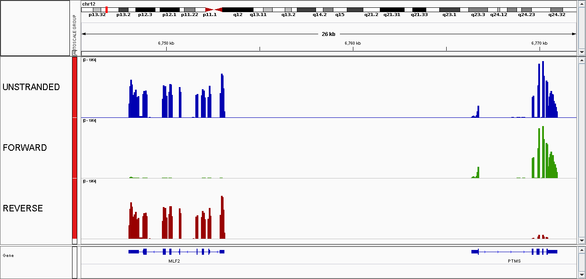


### Mapping QC
[Qualimap](http://qualimap.bioinfo.cipf.es/) is used to check the mapping quality. You'll find qualimap reports in `results/EXAMPLE/mapping_ALIGNER/alignmentQC`. Those reports contain a lot of information:
- information about the mapper
- number and % of mapped reads/pairs
- number of indels and mismatches
- coverage per chromosome
- insert size histogram
- ...  

Once again **MultiQC** aggregates the results of all the samples and you can have a quick overview by looking at `results/EXAMPLE/mapping_ALIGNER/report_align_count_COUNTER.html` or in the final report (ie `20210727T1030_report.html`). 

### Counting

Counting results are saved in `results/EXAMPLE/mapping_ALIGNER/counting_COUNTER` (and in results/EXAMPLE/mapping_ALIGNER/repeats_COUNTER if you have enabled repeat analysis)
```
[username@clust-slurm-client RASflow_IFB]$ tree results/EXAMPLE/mapping_hisat2/counting_featureCounts/
results/EXAMPLE/mapping_hisat2/counting_featureCounts/
├── countTables
│   ├── D197-D192T27_count.tsv
│   ├── D197-D192T27_table.tsv
│   ├── D197-D192T27_table.tsv.summary
│   ├── D197-D192T28_count.tsv
│   ├── D197-D192T28_table.tsv
│   ├── D197-D192T28_table.tsv.summary
|   |...
├── heatmap.pdf
└── PCA.pdf
```

The count tables can be found in `countTables` folder. The `count.tsv` files are the tables with raw, not normalized counts. 

|GeneID | counts |
|-------|--------|
|-------|--------|

The `.summary` contains information about the reads that couldn't be attributed to a feature:

```
[username@clust-slurm-client RASflow_IFB]$ cat results/EXAMPLE/mapping_hisat2/featureCounts/countTables/D197-D192T27_table.tsv.summary
Status	/shared/projects/bi4edc/RASflow_IFB/data/TIMING/hisat2/Sorted_bam/D197-D192T27.sort.bam
Assigned	51236995
Unassigned_Unmapped	265300
Unassigned_Read_Type	0
Unassigned_Singleton	0
Unassigned_MappingQuality	0
Unassigned_Chimera	0
Unassigned_FragmentLength	0
Unassigned_Duplicate	0
Unassigned_MultiMapping	21778669
Unassigned_Secondary	0
Unassigned_NonSplit	0
Unassigned_NoFeatures	1791248
Unassigned_Overlapping_Length	0
Unassigned_Ambiguity	16081650
```

In addition, an interactive MDS plot as well as 2 PDF are generated:
- `Glimma/MDS_Plot.html`
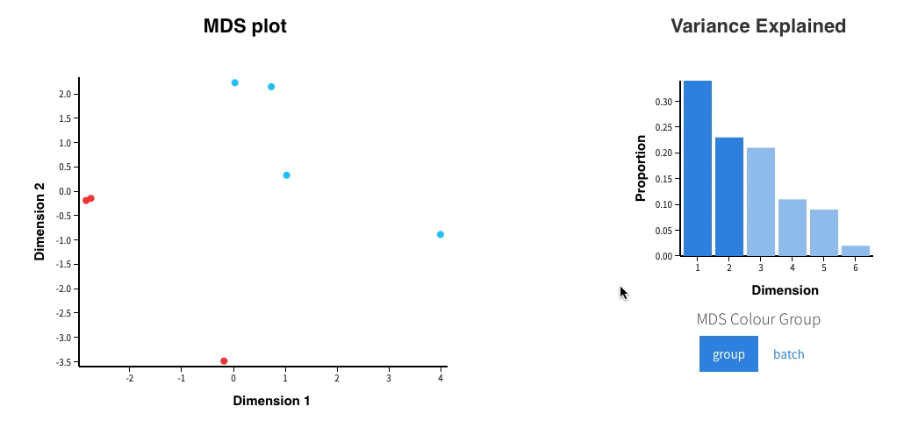
- `PCA.pdf` : it contains two figures 
  - PCA of all the samples, colored by group
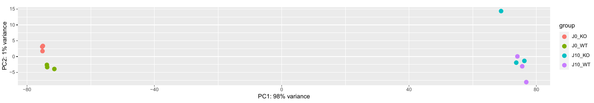
  - distribution of raw counts / samples
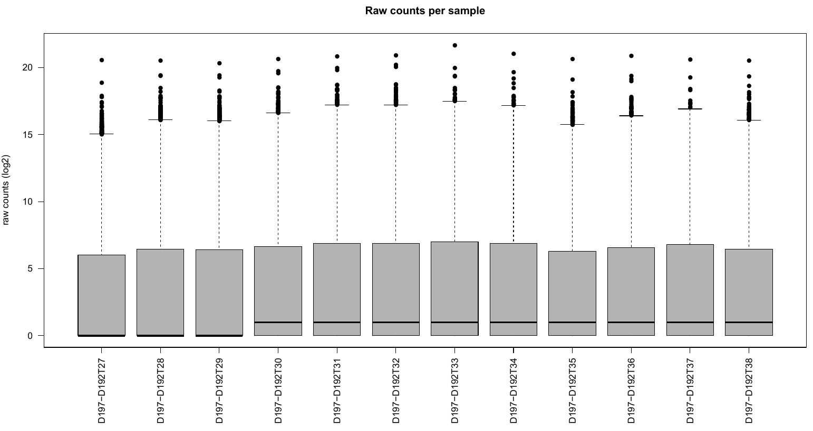
- `Heatmap.pdf` with a heatmap of sample distances 
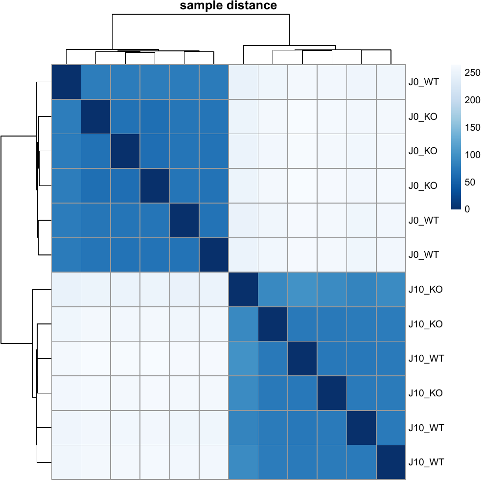

MultiQC is run after the counting, looking at `report_align_count_COUNTER.html` in `results/EXAMPLE/mapping_ALIGNER/` (also included in the final report) will help you to check that everything went fine. 

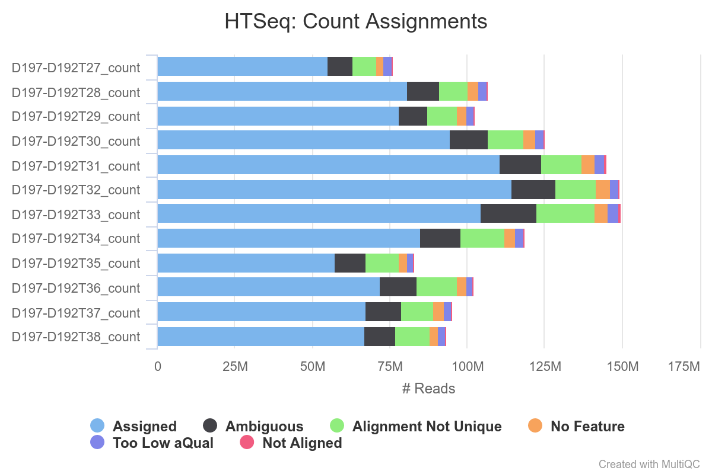


### DEA results

DEA results are in `results/EXAMPLE/mapping_ALIGNER/counting_COUNTER/DEA_DEATOOL`.

```
[username@clust-slurm-client RASflow_IFB]$ tree -L 2 results/EXAMPLE/mapping_hisat2/counting_featureCounts/DEA_DESeq2/
results/EXAMPLE/mapping_hisat2/counting_featureCounts/DEA_DESeq2/
├── Report
│   ├── Glimma
│   ├── plots
│   └── regionReport
└── Tables
    ├── dea_J0_KO_J10_KO.tsv
    ├── dea_J0_WT_J0_KO.tsv
    ├── dea_J0_WT_J10_WT.tsv
    ├── dea_J10_WT_J10_KO.tsv
    ├── deg_J0_KO_J10_KO.tsv
    ├── deg_J0_WT_J0_KO.tsv
    ├── deg_J0_WT_J10_WT.tsv
    ├── deg_J10_WT_J10_KO.tsv
    ├── J0_KO_J10_KO_NormCounts.tsv
    ├── J0_WT_J0_KO_NormCounts.tsv
    ├── J0_WT_J10_WT_NormCounts.tsv
    └── J10_WT_J10_KO_NormCounts.tsv
```

- In `Tables` folder are normalized count tables (`..._NormCounts.tsv`), as well as 
DEA results for each pair of conditions: 
    - dea_J0_WT_J0_KO.tsv contains differential expression for all genes
    - deg_J0_WT_J0_KO.tsv contains only the genes differentially expressed (FDR < 0.05)


- In `Report`, you'll find visual outputs. 

```
[username@clust-slurm-client RASflow_IFB]$ tree -L 2 results/EXAMPLE/mapping_hisat2/counting_featureCounts/DEA_DESeq2/Report/
results/EXAMPLE/mapping_hisat2/counting_featureCounts/DEA_DESeq2/Report/
├── Glimma
│   ├── css
│   ├── js
│   ├── MDPlot_J0_KO_J10_KO.html
│   ├── MDPlot_J0_WT_J0_KO.html
│   ├── MDPlot_J0_WT_J10_WT.html
│   ├── MDPlot_J10_WT_J10_KO.html
│   ├── MDSPlot_J0_KO_J10_KO.html
│   ├── MDSPlot_J0_WT_J0_KO.html
│   ├── MDSPlot_J0_WT_J10_WT.html
│   ├── MDSPlot_J10_WT_J10_KO.html
│   ├── Volcano_J0_KO_J10_KO.html
│   ├── Volcano_J0_WT_J0_KO.html
│   ├── Volcano_J0_WT_J10_WT.html
│   └── Volcano_J10_WT_J10_KO.html
├── plots
│   ├── heatmapTop_J0_KO_J10_KO.pdf
│   ├── heatmapTop_J0_WT_J0_KO.pdf
│   ├── heatmapTop_J0_WT_J10_WT.pdf
│   ├── heatmapTop_J10_WT_J10_KO.pdf
│   ├── PCA_J0_KO_J10_KO.pdf
│   ├── PCA_J0_WT_J0_KO.pdf
│   ├── PCA_J0_WT_J10_WT.pdf
│   ├── PCA_J10_WT_J10_KO.pdf
│   ├── SampleDistances_J0_KO_J10_KO.pdf
│   ├── SampleDistances_J0_WT_J0_KO.pdf
│   ├── SampleDistances_J0_WT_J10_WT.pdf
│   ├── SampleDistances_J10_WT_J10_KO.pdf
│   ├── volcano_plot_J0_KO_J10_KO.pdf
│   ├── volcano_plot_J0_WT_J0_KO.pdf
│   ├── volcano_plot_J0_WT_J10_WT.pdf
│   └── volcano_plot_J10_WT_J10_KO.pdf
└── regionReport
    ├── J0_KO_J10_KO
    ├── J0_WT_J0_KO
    ├── J0_WT_J10_WT
    └── J10_WT_J10_KO
```

In `regionReport` you'll find a report generated by [regionReport](http://leekgroup.github.io/regionReport/reference/index.html) using `DESeq2Report()` or `edgeReport()` for each pair of conditions. 

It contains interesting plots, such as 

- PCA

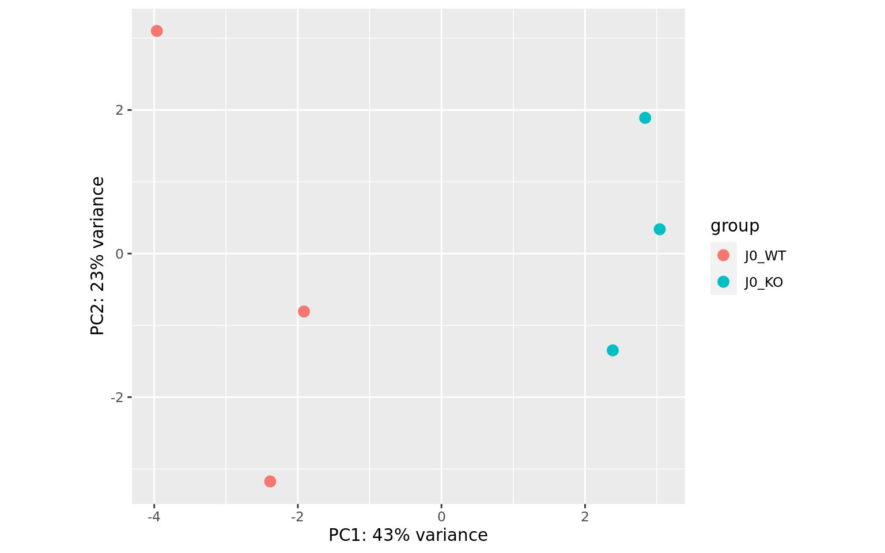

- Sample-to-sample distance heatmap

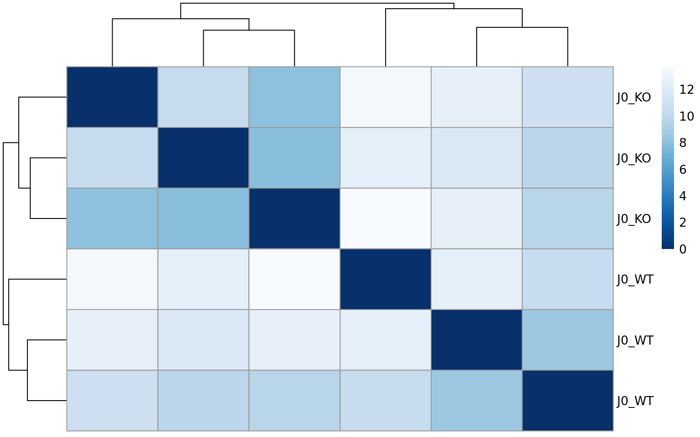

- MA plots

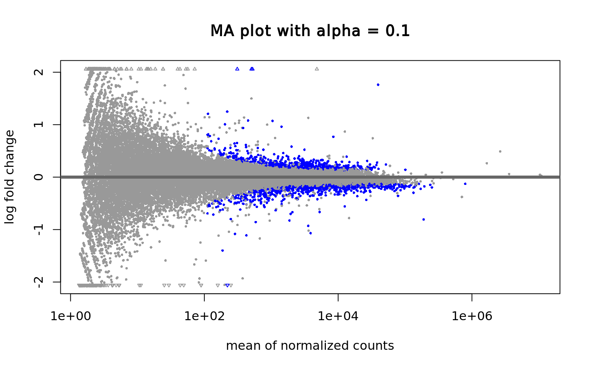

- P-values distribution

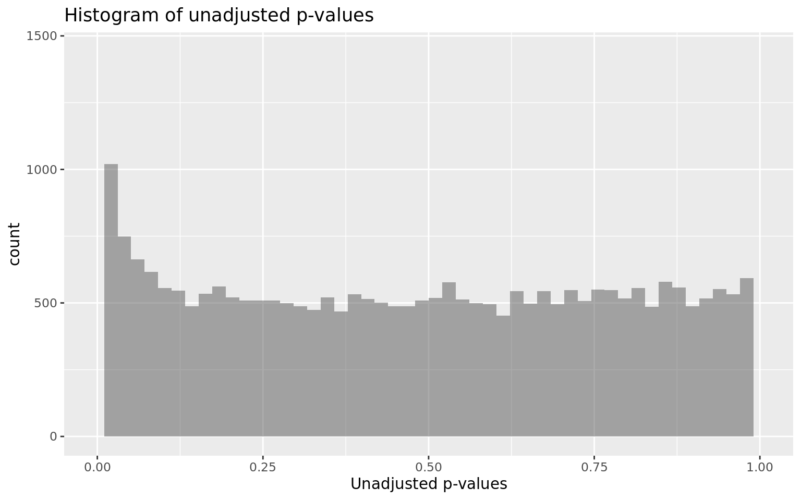

- Count plots for top features

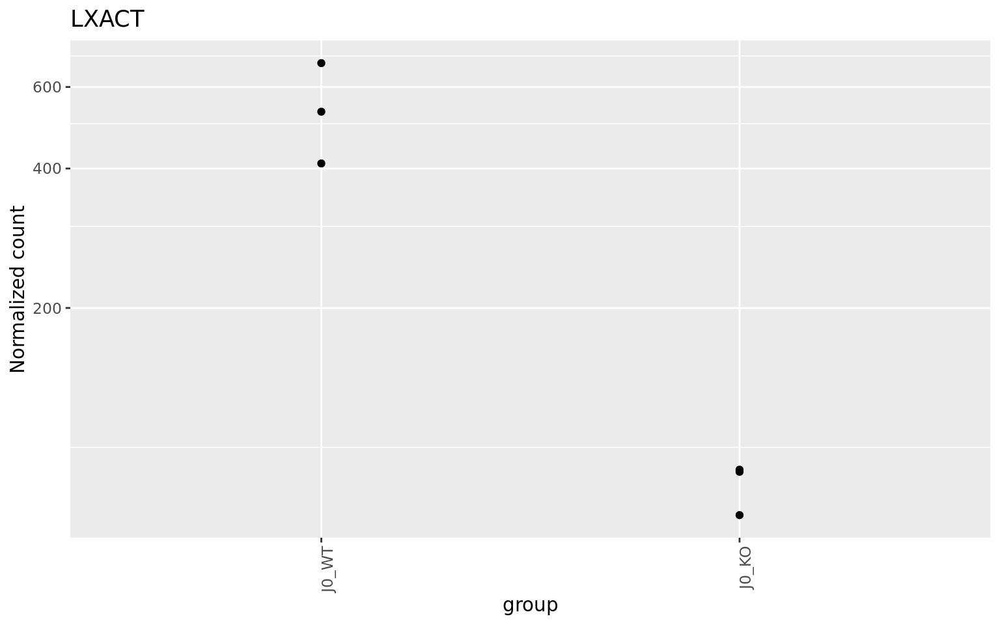

as well as a table with top features 

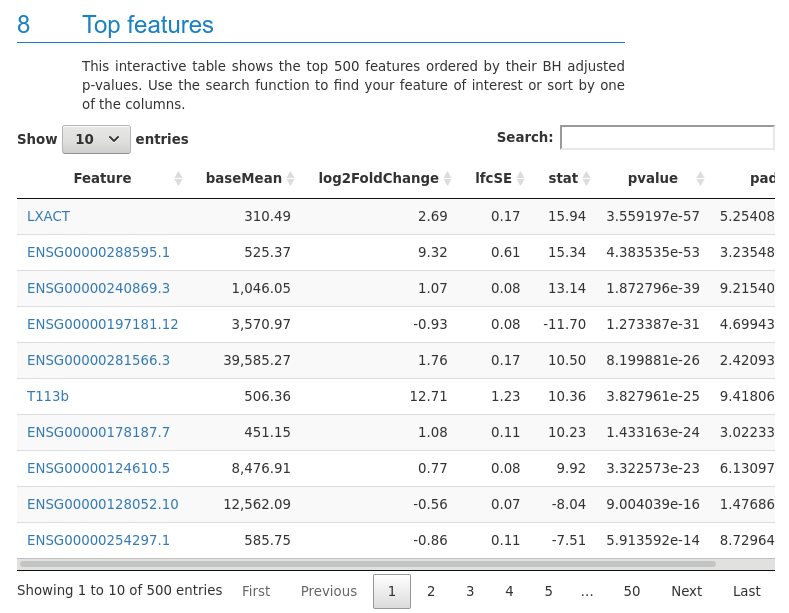

and information about all the tools used to facilitate reproducibility. 

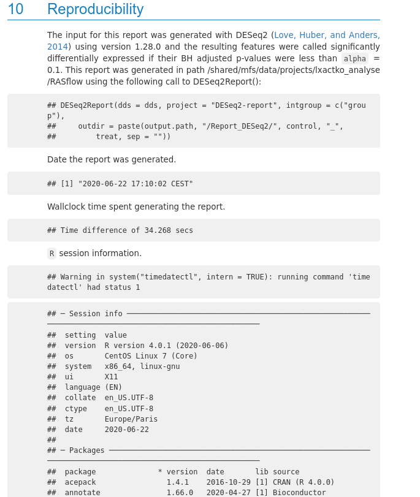

</br></br>
Additional figures can be found in `plots` folder. You'll find for each pair of conditions:
- Volcano plots representing differential expression 
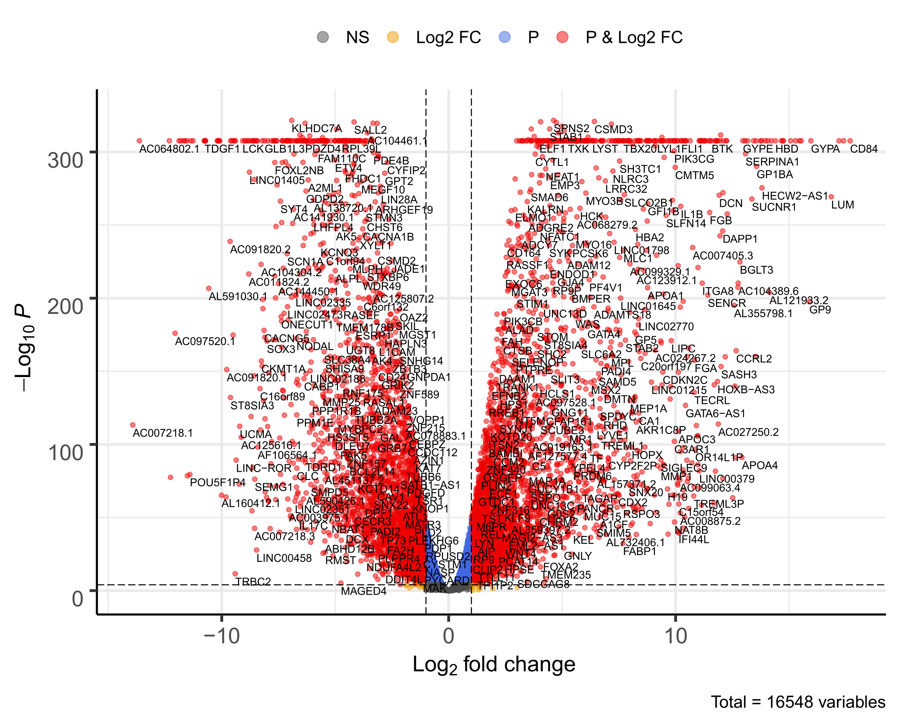
- A heatmap of the 20 most regulated genes

- PCA plots (as in the report)
- Sample-to-sample distance heatmaps (as in the report)

Finally in `Glimma` folder, you'll find interactive plots made with [Glimma](https://github.com/Shians/Glimma) that will help you to explore the results: 
- The MDS plot is an improved PCA representation

- MD plots represent all the genes with the fold change as a function of the average expression. You can click on the points and see the corresponding normalised expression on the right.
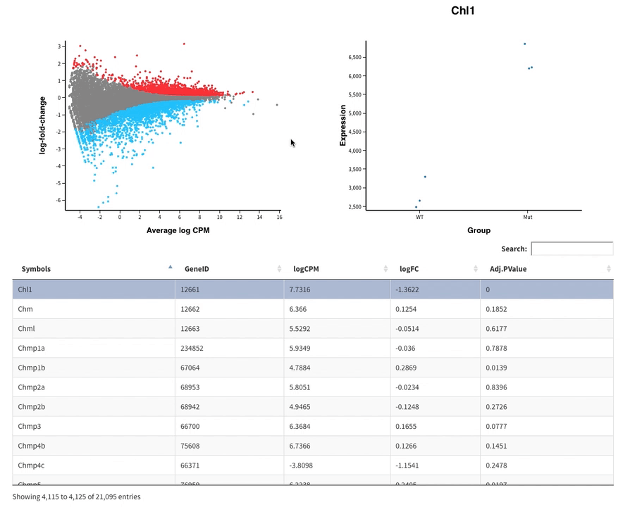
And search in the bar for your favorite gene.
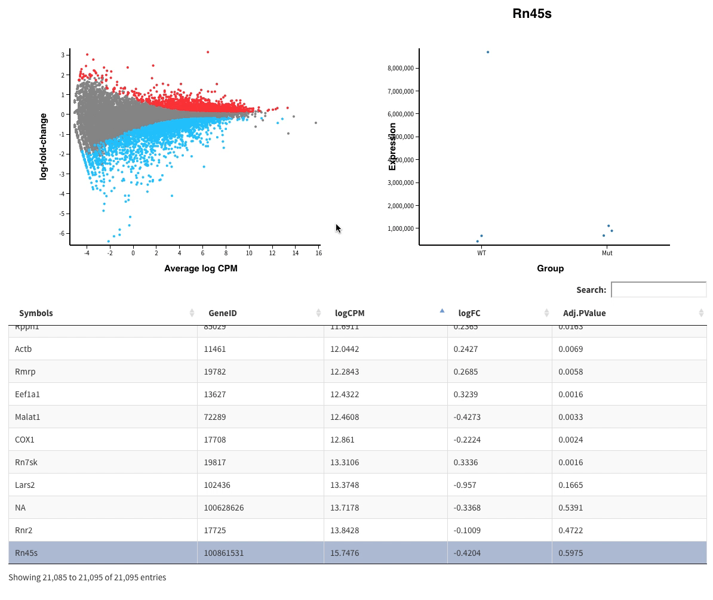
- Volcano plots, with the same functionalities as the MD plots.
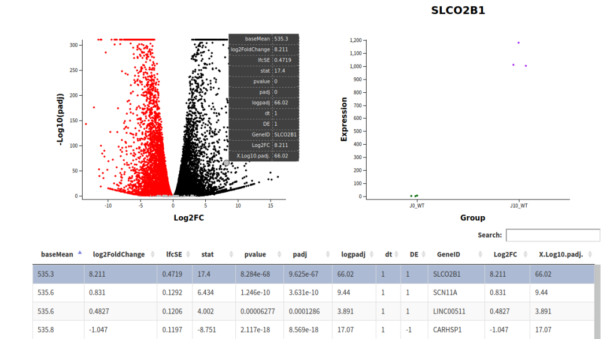

All those plots are included in the final report. 
---
---


## How to follow your jobs

### Running jobs

You can check the jobs that are running using `squeue`.

```
[username@clust-slurm-client RASflow_IFB]$ squeue -u username
```


### Information about past jobs

The `sacct` command gives you information about past and running jobs. The documentation is [here](https://slurm.schedmd.com/sacct.html). You can get different information with the `--format` option. For instance: 

```
[username@clust-slurm-client RASflow_IFB]$ sacct --format=JobID,JobName,Start,CPUTime,MaxRSS,ReqMeM,State
       JobID    JobName               Start    CPUTime     MaxRSS     ReqMem      State 
------------ ---------- ------------------- ---------- ---------- ---------- ---------- 
...
9875767          BigWig 2020-07-27T16:02:48   00:00:59               80000Mn  COMPLETED 
9875767.bat+      batch 2020-07-27T16:02:48   00:00:59     87344K    80000Mn  COMPLETED 
9875768         BigWigR 2020-07-27T16:02:51   00:00:44               80000Mn  COMPLETED 
9875768.bat+      batch 2020-07-27T16:02:51   00:00:44     85604K    80000Mn  COMPLETED 
9875769             PCA 2020-07-27T16:02:52   00:01:22                2000Mn  COMPLETED 
9875769.bat+      batch 2020-07-27T16:02:52   00:01:22    600332K     2000Mn  COMPLETED 
9875770         multiQC 2020-07-27T16:02:52   00:01:16                2000Mn  COMPLETED 
9875770.bat+      batch 2020-07-27T16:02:52   00:01:16    117344K     2000Mn  COMPLETED 
9875773        snakejob 2020-07-27T16:04:35   00:00:42                2000Mn  COMPLETED 
9875773.bat+      batch 2020-07-27T16:04:35   00:00:42     59360K     2000Mn  COMPLETED 
9875774             DEA 2020-07-27T16:05:25   00:05:49                2000Mn    RUNNING 
```

Here you have the job ID and name, its starting time, its running time, the maximum RAM used, the memory you requested (it has to be higher than MaxRSS, otherwise the job fails, but not much higher to allow the others to use the resource), and job status (failed, completed, running). 

**Add `-S MMDD` to have older jobs (default is today only).** 

```
[username@clust-slurm-client RASflow_IFB]$ sacct --format=JobID,JobName,Start,CPUTime,MaxRSS,ReqMeM,State -S 0518
```

### Cancelling a job
If you want to cancel a job: scancel job number

```
[username@clust-slurm-client RASflow_IFB]$ scancel 8016984
```

Nota: when snakemake is working on a folder, this folder is locked so that you can't start another DAG and create a big mess. If you cancel the main job, snakemake won't be able to unlock the folder (see [below](#folder-locked)). 

## Having errors? 
To quickly check if everything went fine, you have to check the main log. If everything went fine you'll have :

```
[username@clust-slurm-client RASflow_IFB]$ cat slurm_output/RASflow-13350656.out 
########################################
Date: 2020-09-25T10:57:14+0200
User: mhennion
Host: cpu-node-60
Job Name: RASflow
Job Id: 13350656
Directory: /shared/projects/bi4edc/RASflow_IFB
########################################
RASflow_IFB version: v0.4
[...]
RASflow is done!
########################################
---- Errors ----
There were no errors ! It's time to look at your results, enjoy!
########################################
Job finished 2020-09-25T11:06:50+0200
---- Total runtime 576 s ; 9 min ----
```

If not, you'll see a summary of the errors: 
```
[username@clust-slurm-client RASflow_IFB]$ cat slurm_output/RASflow-13605306.out 
########################################
Date: 2020-11-04T09:21:28+0100
User: mhennion
Host: cpu-node-28
Job Name: RASflow
Job Id: 13605306
Directory: /shared/projects/bi4edc/RASflow_IFB
########################################
RASflow_IFB version: v0.4
[...]
RASflow is done!
########################################
---- Errors ----
logs/20201104T0921_dea_genome.txt	-        Rscript scripts/dea_genome.R /shared/projects/repeats/RASflow_IFB/results/H9/mapping_hisat2/counting_featureCounts/countTables/ /shared/projects/repeats/RASflow_IFB/results/H9/mapping_hisat2/counting_featureCounts/DEA_DESeq2/
logs/20201104T0921_dea_genome.txt	-        (one of the commands exited with non-zero exit code; note that snakemake uses bash strict mode!)
logs/20201104T0921_dea_genome.txt	-
logs/20201104T0921_dea_genome.txt	-Error executing rule DEA on cluster (jobid: 1, external: 13605307, jobscript: /shared/mfs/data/projects/bi4edc/RASflow_IFB/.snakemake/tmp.ig057qsd/snakejob.DEA.1.sh). For error details see the cluster log and the log files of the involved rule(s).
logs/20201104T0921_dea_genome.txt	-Job failed, going on with independent jobs.
logs/20201104T0921_dea_genome.txt	:Exiting because a job execution failed. Look above for error message
logs/20201104T0921_dea_genome.txt	-Complete log: /shared/mfs/data/projects/bi4edc/RASflow_IFB/.snakemake/log/2020-11-04T092135.247706.snakemake.log

########################################
Job finished 2020-11-04T09:25:23+0100
---- Total runtime 235 s ; 3 min ----
```

And you can check the problem looking as the specific log file, here `logs/20201104T0921_dea_genome.txt` 
```
[Wed Nov  4 09:21:40 2020]
rule DEA:
    input: ...
    output: ...
    jobid: 1

Submitted DRMAA job 1 with external jobid 13605307.
[Wed Nov  4 09:25:10 2020]
Error in rule DEA:
    jobid: 1
    output: ...
    conda-env: /shared/mfs/data/projects/bi4edc/RASflow_IFB/.snakemake/conda/43b54aba
    shell:
        Rscript scripts/dea_genome.R /shared/...
        (one of the commands exited with non-zero exit code; note that snakemake uses bash strict mode!)

Error executing rule DEA on cluster (jobid: 1, external: 13605307, jobscript: /shared/mfs/data/projects/bi4edc/RASflow_IFB/.snakemake/tmp.ig057qsd/snakejob.DEA.1.sh). For error details see the cluster log and the log files of the involved rule(s).
Job failed, going on with independent jobs.
Exiting because a job execution failed. Look above for error message
Complete log: /shared/mfs/data/projects/bi4edc/RASflow_IFB/.snakemake/log/2020-11-04T092135.247706.snakemake.log
```
You can have the description of the error in the SLURM output corresponding to the external jobid, here 13605307: 

```
[username @ clust-slurm-client RASflow_IFB]$ cat slurm_output/slurm-13605307.out
```

---

## Common errors

### Error starting gedit
If you encounter an error starting gedit

```
[unsername @ clust-slurm-client 16:04]$ ~ : gedit toto.txt
(gedit:6625): Gtk-WARNING **: cannot open display: 
```

Be sure to include `-X` when connecting to the cluster (`-X` option is necessary to run graphical applications remotely).
Use : 

```
You@YourComputer:~$ ssh -X unsername@core.cluster.france-bioinformatique.fr
```

or 

```
You@YourComputer:~$ ssh -X -o "ServerAliveInterval 10" unsername@core.cluster.france-bioinformatique.fr
```

The option `-o "ServerAliveInterval 10"` is facultative, it keeps the connection alive even if you're not using your shell for a while. 


### Initial QC fails

If you don't get MultiQC `report_quality_control.html` report in `results/EXAMPLE/fastqc`, you may have some fastq files not fitting the required format:
- SampleName_R1.fastq.gz and SampleName_R2.fastq.gz for pair-end data, 
- SampleName.fastq.gz for single-end data.

Please see [how to correct a batch of FASTQ files](#quickly-change-fastq-names). 


### Memory 
I set up the memory necessary for each rule, but it is possible that big datasets induce a memory excess error. In that case the job stops and you get in the corresponding Slurm output something like this: 

```
slurmstepd: error: Job 8430179 exceeded memory limit (10442128 > 10240000), being killed
slurmstepd: error: Exceeded job memory limit
slurmstepd: error: *** JOB 8430179 ON cpu-node-13 CANCELLED AT 2020-05-20T09:58:05 ***
Will exit after finishing currently running jobs.
```

In that case, you can increase the memory request by modifying in `cluster.yaml` the `mem` entry corresponding to the rule that failed. 

```yaml
[username@clust-slurm-client RASflow_IFB]$ cat cluster.yaml 
__default__:
  mem: 2000
  name: snakejob

qualityControl:
  mem: 6000
  name: QC

trim:
  mem: 6000
  name: trimming

hisat2:
  mem: 7000
  name: hisat2

star:
  mem: 40000
  name: star

alignmentQC:
  mem: 7000
  name: aligQC

BigWig:
  mem: 80000
  name: BigWig
...
```

If the rule that failed is not listed here, you can add it respecting the format. And restart your workflow. 

### Folder locked

When snakemake is working on a folder, this folder is locked so that you can't start another DAG and create a big mess. If you cancel the main job, snakemake won't be able to unlock the folder and next time you run `Workflow.sh`, you will get the following error:

```
Error: Directory cannot be locked. Please make sure that no other Snakemake process is trying to create the same files in the following directory:
/shared/mfs/data/projects/lxactko_analyse/RASflow
If you are sure that no other instances of snakemake are running on this directory, the remaining lock was likely caused by a kill signal or a power loss. It can be removed with the --unlock argument.
```

In order to remove the lock, run:

```
[username@clust-slurm-client RASflow_IFB]$ sbatch Unlock.sh
```

Then you can restart your workflow. 


### Storage space
Sometimes you may reach the quota you have for your project. To check the quota, run: 

```
[username@clust-slurm-client RASflow_IFB]$ lfsgetquota YourProjectName
```

In principle it should raise an error, but sometimes it doesn't and it's hard to find out what is the problem. So if a task fails with no error (typically mapping or counting), try to make more space (or ask for more space on [Community support](https://community.cluster.france-bioinformatique.fr)) before trying again. 

---

## Good practice
- Always save **job ID** or the **dateTtime** (ie 20200615T1540) in your notes when launching `Workflow.sh`. It's easier to find the outputs you're interested in days/weeks/months/years later.

---

## Juggling with several projects
If you work on several projects [as defined by IFB cluster documentation], you can either
- have one independant installation of RASflow_IFB / project with its own Conda environment. To do that, git clone RASflow_IFB repository in each project. The Conda environment will be built again for each project, which takes ~30 min and uses ~12 G of space. 
- have an independant RASflow_IFB folder, but share the Conda environment.  To do that, git clone RASflow_IFB repository in each project, but, before running any analysis, create a symbolic link of the `.snakemake` from your first project:
```
[username@clust-slurm-client PROJECT2]$ cd RASflow_IFB
[username@clust-slurm-client RASflow_IFB]$ ln -s /shared/projects/YourFirstProjectName/RASflow_IFB/.snakemake/ .snakemake
```
- Have only one RASflow_IFB folder and start all your analysis from the same project, but reading input files and writing result files in a different project. 

I will see with IFB core cluster people if this is possible to make it available as a module. 


---
## Tricks 

### Make aliases
To save time avoiding typing long commands again and again, you can add aliases to your `.bashrc` file (change only the aliases, unless you know what you're doing). 

``` 
[username@clust-slurm-client ]$ cat ~/.bashrc 
# .bashrc

# Source global definitions
if [ -f /etc/bashrc ]; then
	. /etc/bashrc
fi

# Uncomment the following line if you don't like systemctl's auto-paging feature:
# export SYSTEMD_PAGER=

# User specific aliases and functions

alias qq="squeue -u username"
alias sa="sacct --format=JobID,JobName,Start,CPUTime,MaxRSS,ReqMeM,State"
alias ll="ls -lht --color=always"
```

It will work next time you connect to the server. When you type `sa`, you will get the command `sacct --format=JobID,JobName,Start,CPUTime,MaxRSS,ReqMeM,State` running. 

### Quickly change fastq names

It is possible to quickly rename all your samples using `mv`. For instance if your samples are named with dots instead of underscores and without `R`: 

```
[username@clust-slurm-client Raw_fastq]$ ls
D192T27.1.fastq.gz  
D192T27.2.fastq.gz  
D192T28.1.fastq.gz  
D192T28.2.fastq.gz  
D192T29.1.fastq.gz  
D192T29.2.fastq.gz  
D192T30.1.fastq.gz  
D192T30.2.fastq.gz  
D192T31.1.fastq.gz  
D192T31.2.fastq.gz  
D192T32.1.fastq.gz  
D192T32.2.fastq.gz  
```

You can modify them using `mv` and a loop on sample numbers. 

```
[username@clust-slurm-client Raw_fastq]$ for i in `seq 27 32`; do mv D192T$i\.1.fastq.gz D192T$i\_R1.fastq.gz; done
[username@clust-slurm-client Raw_fastq]$ for i in `seq 27 32`; do mv D192T$i\.2.fastq.gz D192T$i\_R2.fastq.gz; done
```

Now sample names are OK:

```
[username@clust-slurm-client Raw_fastq]$ ls
D192T27_R1.fastq.gz  
D192T27_R2.fastq.gz  
D192T28_R1.fastq.gz  
D192T28_R2.fastq.gz  
D192T29_R1.fastq.gz  
D192T29_R2.fastq.gz  
D192T30_R1.fastq.gz  
D192T30_R2.fastq.gz  
D192T31_R1.fastq.gz  
D192T31_R2.fastq.gz  
D192T32_R1.fastq.gz  
D192T32_R2.fastq.gz  
```


## Running your analysis on RPBS cluster

The exact same version of the workflow is installed on RPBS cluster [NOTA: this is not true since the 2nd lockdown, I'll do it when I come to the lab.]. You don't have to clone the GitHub repository. Here is a quick tutorial with only the differences with IFB cluster.

- Transfer your data to `/home/joule/RPBSusername` 

```
You@YourComputer:~/PathTo/RNAseqProject$ rsync -avP  Fastq/ RPBSusername@goliath.sdv.univ-paris-diderot.fr:/home/joule/RPBSusername/YourProjectName/Raw_fastq
```

Nota: you should not use `/scratch` to store data. 

- Login to RPBS cluster:

```
username@YourComputer:~$ ssh RPBSusername@goliath.sdv.univ-paris-diderot.fr
```

- Go to your user folder on `scratch`:

``` 
[RPBSusername @ goliath hh:mm]$ ~ : cd /scratch/user/RPBSusername
```

It is important to launch the workflow from `scratch` as this is where the conda environnement is built. [This will change with the cluster upgrade]. 

- Create your working directory (named as you want, I put `RASflow` as an example) and copy the `user` files into it:

```
[RPBSusername @ goliath hh:mm]$ RPBSusername : mkdir RASflow
[RPBSusername @ goliath hh:mm]$ RPBSusername : cp -pr /scratch/epigenetique/workflows/RASflow_RPBS/user/* RASflow
```

- Go to your folder and modify the configuration files according to your experiment. In principle you only need to modify `configs/metadata.tsv` and `configs/config_main.yaml`:

```
[RPBSusername @ goliath hh:mm]$ RPBSusername : cd RASflow
[RPBSusername @ goliath hh:mm]$ RASflow : ls -l 
total 16
-rw-r--r-- 1 hennion umr7216  247 Jul 23 17:05 cluster.yaml
drwxr-xr-x 2 hennion umr7216 4096 Jul 24 09:35 configs
-rw-r--r-- 1 hennion umr7216 1059 Jul 24 10:05 Unlock.sh
-rwxr-xr-x 1 hennion umr7216 1275 Jul 24 10:15 Workflow.sh
[RPBSusername @ goliath hh:mm]$ RASflow : ls -l configs/
total 12K
-rw-r--r-- 1 hennion umr7216  315 Jul 24 10:40 metadata.tsv
-rw-r--r-- 1 hennion umr7216 5,0K Jul 24 10:40 config_main.yaml
```

Please save the outputs in your user directory on `joule`:

```yaml
# ================== Shared parameters for some or all of the sub-workflows ==================

## key file if the data is stored remotely, otherwise leave it empty
KEY: 

## the path to fastq files
READSPATH: /home/joule/RPBSusername/Raw_fastq

## the meta file describing the experiment settings
METAFILE: /scratch/user/RPBSusername/RASflow/configs/metadata.tsv

## is the sequencing paired-end or single-end?
END: pair  # "pair" or "single"

## number of cores you want to allocate to this workflow
NCORE: 30  # Use command "getconf _NPROCESSORS_ONLN" to check the number of cores/CPU on your machine

## paths for intermediate outputs and final outputs
OUTPUTPATH: /home/joule/RPBSusername/RASflow/data # intermediate output. do not upload to github
FINALOUTPUT: /home/joule/RPBSusername/RASflow/output
```

- Run the workflow:

```
[RPBSusername @ goliath hh:mm]$ RASflow : sbatch Workflow.sh
```
- After the run  
Once you're done, you have to transfer all your data to **goliath.** 
