- [Tutorial RASflow on IFB core cluster](#tutorial-rasflow-on-ifb-core-cluster)
  * [Resources](#resources)
  * [Get an account on IFB core cluster and create a project](#get-an-account-on-ifb-core-cluster-and-create-a-project)
  * [Transfer your data](#transfer-your-data)
    + [Fastq names](#fastq-names)
  * [Connect to IFB core cluster](#connect-to-ifb-core-cluster)
  * [RASflow installation and description](#rasflow-installation-and-description)
    + [1. **Workflow.sh**](#1---workflowsh--)
    + [2. **metadata.tsv**](#2---metadatatsv--)
    + [3. **config_main.yaml**](#3---config-mainyaml--)
    + [3. **env.yaml** (facultative)](#3---envyaml----facultative-)
  * [Running your analysis step by step](#running-your-analysis-step-by-step)
    + [QC](#qc)
    + [Description of the log files](#description-of-the-log-files)
    + [FastQC results](#fastqc-results)
    + [Trimming](#trimming)
    + [Mapping and feature count](#mapping-and-feature-count)
    + [Differential expression analysis and visualization](#differential-expression-analysis-and-visualization)
  * [Expected outputs](#expected-outputs)
    + [Trimmed reads](#trimmed-reads)
      - [Trimming report](#trimming-report)
      - [FastQC of trimmed reads](#fastqc-of-trimmed-reads)
    + [Mapped reads](#mapped-reads)
    + [BigWig](#bigwig)
    + [Mapping QC](#mapping-qc)
    + [Count Tables](#count-tables)
    + [DEA results](#dea-results)
      - [regionReport](#regionreport)
  * [How to follow your jobs](#how-to-follow-your-jobs)
    + [Running jobs](#running-jobs)
    + [Information about past jobs](#information-about-past-jobs)
    + [Cancelling a job](#cancelling-a-job)
  * [Tricks](#tricks)
    + [Make aliases](#make-aliases)
  * [Common errors](#common-errors)
    + [Memory](#memory)
    + [Folder locked](#folder-locked)
  * [Good practice](#good-practice)

<small><i><a href='http://ecotrust-canada.github.io/markdown-toc/'>Table of contents generated with markdown-toc</a></i></small>


# Tutorial RASflow on IFB core cluster

## Resources

- IFB  
  - Create and manage your [account](https://my.cluster.france-bioinformatique.fr/manager2/login)  
  - Community [support](https://community.cluster.france-bioinformatique.fr)   
  - [Documentation](https://ifb-elixirfr.gitlab.io/cluster/doc/)  

- RASflow, Zhang, X.  
  - [RASflow git repo](https://github.com/zhxiaokang/RASflow)  
  - [Papier](https://doi.org/10.1186/s12859-020-3433-x)   
  - [Tutorial](https://github.com/zhxiaokang/RASflow/blob/master/Tutorial.pdf)


---

## Get an account on IFB core cluster and create a project

We highly recommend to first read at least the [Quick Start](https://ifb-elixirfr.gitlab.io/cluster/doc/quick-start/) of the cluster [documentation](https://ifb-elixirfr.gitlab.io/cluster/doc/). 

To ask for an account you have to go to [my.cluster.france-bioinformatique.fr](https://my.cluster.france-bioinformatique.fr/manager2/login), click on `create an account` and fill the form. You will then shortly receive an email to activate your account.  
Once your account is active, you have to connect to [my.cluster.france-bioinformatique.fr/manager2/project](https://my.cluster.france-bioinformatique.fr/manager2/project) in order to create a new project. You will then receive an email when it's done (few hours usually). 

---

## Transfer your data
Once your project is created you can access it at `/shared/projects/YourProjectName`. This is where you should transfer your data before doing your analysis. 

### Fastq names
The workflow is expecting gzip compressed fastq files with names formatted as   
- SampleName_R1.fastq.gz and SampleName_R2.fastq.gz for pair-end data, 
- SampleName.fastq.gz for single-end data. 

It is recommended to check the md5sum for big files. If your raw fastq files are on your computer in `PathTo/RNAseqProject/Fastq/`, you can type in a terminal: 
```
You@YourComputer:~$ cd PathTo/RNAseqProject
You@YourComputer:~/PathTo/RNAseqProject$ md5sum Fastq/* > Fastq/fastq.md5
```
You can then copy the Fastq folder to the cluster using `rsync`, replacing `username` by your IFB login: 
```
You@YourComputer:~/PathTo/RNAseqProject$ rsync -avP  Fastq/ username@core.cluster.france-bioinformatique.fr:/shared/projects/YourProjectName/Raw_fastq
```
You will be asked to enter your password, and then the transfer will begin. If it stops before the end, rerun the last command, it will only add the incomplete/missing files. 

---

## Connect to IFB core cluster

It's time to go to the cluster!

```bash
You@YourComputer:~/PathTo/RNAseqProject$ ssh -o "ServerAliveInterval 10" -X username@core.cluster.france-bioinformatique.fr
```
You will have to enter your password, and then you'll be connected to your home directory. Here you can run small tests, but everything related to a specific project should be done in the corresponding folder. 

```
username@core.cluster.france-bioinformatique.fr's password: 
Last login: Tue May  5 16:30:23 2020 from 78.250.99.64
#############################################################################
##   Bienvenue sur le Cluster IFB Core                                     ##
##                                                                         ##
##   Pour toute question, demande de support, d’installation d’outils      ##
##   ou d’aide sur une thématique, un outil ou un paramètre,               ##
##   rejoignez-nous sur:                                                   ##
##        https://community.france-bioinformatique.fr                      ##
##                                                                         ##
##  **** COVID-19 epidemic  ****                                           ##
##  Due to recent developments in the COVID-19 epidemic, all platform      ##
##  staff is now teleworking. We are doing our best to keep the platform   ##
##  up and running, please excuse in advance our lack of availability.     ## 
##                                                                         ##
##   L'équipe de support Cluster IFB Core                                  ##
##                                                                         ##
############################################################################
[username@clust-slurm-client ~]$ 
```
You can now go to your project
```
[username@clust-slurm-client ~]$ cd /shared/projects/YourProjectName
```
and check the files in `Raw_fastq`
```
[username@clust-slurm-client YourProjectName]$ ll `Raw_fastq
```

Check that the transfer went fine using md5sum
```
[username@clust-slurm-client YourProjectName]$ cd Raw_fastq
[username@clust-slurm-client Raw_fastq]$ md5sum -c fastq.md5
```

---

## RASflow installation and description

Here is a scheme of the workflow as implemented on the IFB cluster. In the green circles are the input files you have to give for the different steps. 

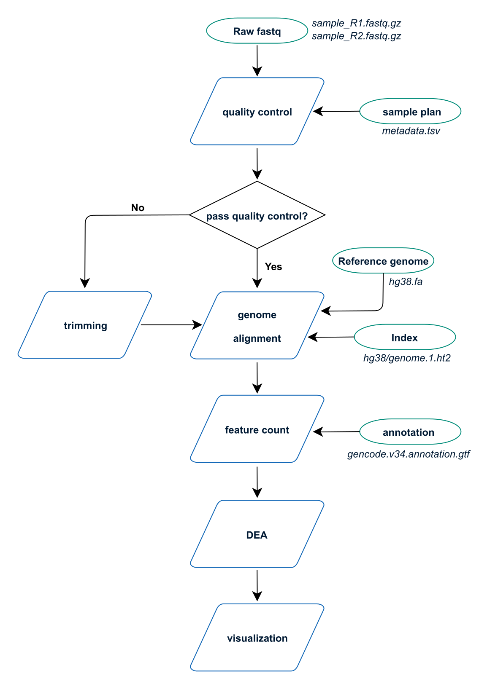

The first step is to clone RASflow_IFB to your project, and to look at the files. 

```
[username@clust-slurm-client Raw_fastq]$ cd ..
[username@clust-slurm-client YourProjectName]$ git clone https://github.com/parisepigenetics/RASflow_IFB
[username@clust-slurm-client YourProjectName]$ cd RASflow_IFB
[username@clust-slurm-client RASflow_IFB]$ ll
total 3030
-rw-rw----+ 1 mhennion mhennion     243 Jun  3 14:42 cluster.yml
drwxr-x---+ 2 mhennion mhennion 1002187 Jun  9 16:55 configs
drwxrwx---+ 2 mhennion mhennion       1 Jun  9 16:10 data
drwxrwx---+ 2 mhennion mhennion       1 Jun  9 16:12 gtf
drwxrwx---+ 2 mhennion mhennion       1 Jun  9 16:12 index
drwxrwx---+ 2 mhennion mhennion       1 Jun  9 16:12 logs
-rw-rw----+ 1 mhennion mhennion    5519 May 27 15:14 main_cluster.py
drwxr-x---+ 2 mhennion mhennion 1011000 Jun  9 16:16 scripts
drwxrwx---+ 2 mhennion mhennion       1 Jun  9 16:14 slurm_output
drwxr-x---+ 2 mhennion mhennion 1078670 Jun  9 16:47 workflow
-rw-rw----+ 1 mhennion mhennion    1320 Jun  9 16:27 Workflow.sh
```

There are **3 files** that you have to modify before running your analysis, and  another one not mandatory.  

### 1. **Workflow.sh**

RASflow is launched as a python script named `main_cluster.py` which calls the workflow manager named [snakemake](https://snakemake.readthedocs.io/en/stable/snakefiles/rules.html). On the cluster this python script is launch via the shell script `Workflow.sh`, which basically contains only one command (+ information about the job). 

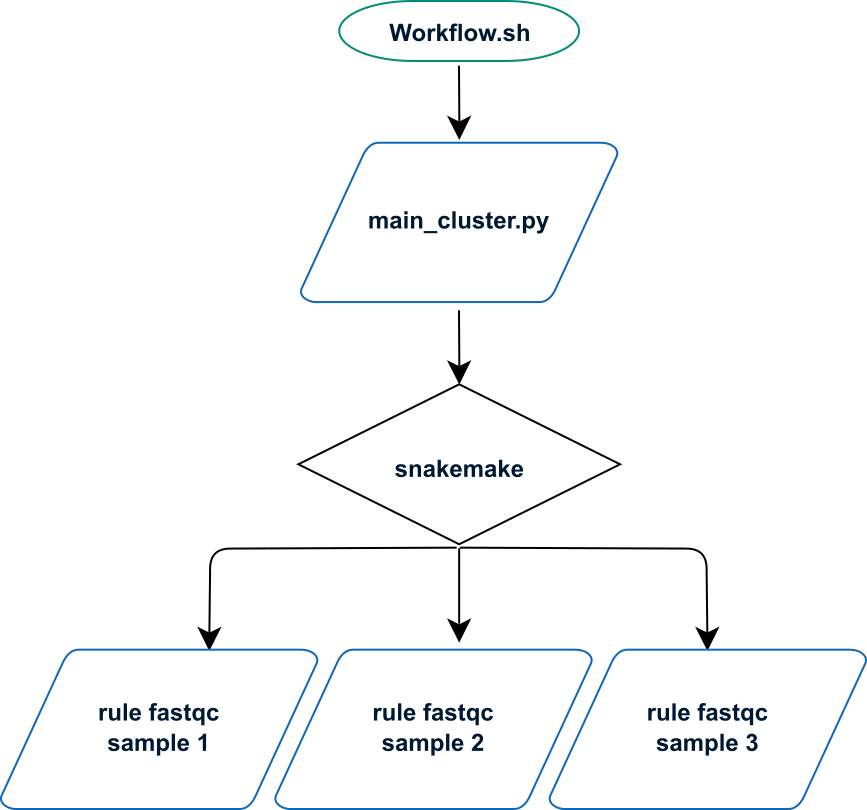

```bash
[...]
# modules loading
module load snakemake python conda slurm-drmaa

# remove display to make qualimap run:
unset DISPLAY

# What you actually want to launch
python /shared/projects/YourProjectName/RASflow_IFB/main_cluster.py
[...]
```
You have to modify the command to fit your project name (replace `YourProjectName`). To modify the text files on the cluster you can use **vi**, **emacs**, **nano** or **gedit** (the last one being easier to use).
``` 
[username@clust-slurm-client RASflow_IFB]$ gedit Workflow.sh
```

[Facultative]  
In `Workflow.sh`, you can also modify the **Job name** and the **Output** folder to save slurm outputs. If you don't change this file, slurm outputs will be saved in your working directory. The line is read if it starts with one `#` and is not used if it starts with 2 (or more) `#`. For instance here

```bash
[username@clust-slurm-client RASflow_IFB]$ cat Workflow.sh
#!/bin/bash

################################ Slurm options #################################

### Job name 
##SBATCH --job-name=QC 

### Output
##SBATCH --output=/shared/projects/YourProjectName/RASflow_IFB/slurm_output/QC-%j.out
[...]
```
the default path is used, whereas here
```bash
#!/bin/bash

################################ Slurm options #################################

### Job name 
#SBATCH --job-name=QC 

### Output
#SBATCH --output=/shared/projects/YourProjectName/RASflow_IFB/slurm_output/QC-%j.out
[...]
```
the job name will be `QC` and slurm output (only for the snakemake commands, not for the jobs launched by snakemake) will go to `slurm_output/QC-%j.out`. 

### 2. **metadata.tsv**

The experimental description is set up in `config/metadata.tsv`: 
```
[username@clust-slurm-client RASflow_IFB]$ cat configs/metadata.tsv 
sample	group	subject
D197-D192T27	J0_WT	1
D197-D192T28	J0_WT	2
D197-D192T29	J0_WT	3
D197-D192T30	J0_KO	1
D197-D192T31	J0_KO	2
D197-D192T32	J0_KO	3
D197-D192T33	J10_WT	1
D197-D192T34	J10_WT	2
D197-D192T35	J10_WT	3
D197-D192T36	J10_KO	1
D197-D192T37	J10_KO	2
D197-D192T38	J10_KO	3
```   
**Important:** the columns have to be **tab-separated**. 

The first column contains the **sample** names that have to correspond to the fastq names (for instance here D197-D192T27_R1.fastq.gz). The second column describes the **group** the sample belongs to and will be used for differential expression analysis. The last column contains the replicate number or **subject**. If the samples are paired, for instance 2 samples from the same patient taken at different times, the **subject** number should be the same (this information is important for differential expression analysis).

### 3. **config_main.yaml**

The configuration of the workflow (see step by step description below) is done in `config/config_main.yaml` that contains different parts:  

   1. Define project name and the steps of the workflow you want to run

```yaml
[username@clust-slurm-client RASflow_IFB]$ cat configs/config_main.yaml 
# Please check the parameters, and adjust them according to your circumstance

# Project name
PROJECT: EXAMPLE

# ================== Control of the workflow ==================

## Do you need to do quality control?
QC: yes  # "yes" or "no"

## Do you need to do trimming?
TRIMMED: "yes"  # "yes" or "no"? 

## Which mapping reference do you want to use? Genome or transcriptome?
REFERENCE: genome  # "genome" or "transcriptome", I haven't implemented transcriptome yet. 

## alignment quality control
alignmentQC: yes  # "yes" or "no" to specify whether you want to do alignment QC

## Do you want to do Differential Expression Analysis (DEA)?
DEA: yes  # "yes" or "no"

## Do you want to visualize the results of DEA?
VISUALIZE: yes  # "yes" or "no"
```
3.   2. shared parameters
```yaml
# ================== Shared parameters for some or all of the sub-workflows ==================

## key file if the data is stored remotely, otherwise leave it empty
KEY: 

## the path to fastq files
READSPATH: /shared/projects/YourProjectName/Raw_fastq

## the meta file describing the experiment settings
METAFILE: /shared/projects/YourProjectName/RASflow_IFB/configs/metadata.tsv

## is the sequencing paired-end or single-end?
END: pair  # "pair" or "single"

## number of cores you want to allocate to this workflow
NCORE: 30  # Use command "getconf _NPROCESSORS_ONLN" to check the number of cores/CPU on your machine

## paths for intermediate outputs and final outputs
OUTPUTPATH: /shared/projects/YourProjectName/RASflow_IFB/data # intermediate output. do not upload to github
FINALOUTPUT: /shared/projects/YourProjectName/RASflow_IFB/output

```
3.   3. Configuration of the specific tools
```yaml
# ================== Configuration for Quality Control ==================

## All required params have already been defined in the public params

# ================== Configuration for trimming ==================

## Number of trimmed bases
## put "no" for TRIM3 if you don't want to trim a fixed number of bases. 
TRIM3: 91 #  hard-clip sequences from their 5' end, keep the N 3' end bases (remove start of the sequences) , put "no" if don't want trimming 
TRIM5: 91 # hard-clip sequences from their 3' end, keep the N 5' end bases (remove end of the sequences) , the trimming of the beginning of the read is done first. This number should be smaller than or equal to TRIM3 (it is the final length of the sequences). 
# ================== Configuration for quantification using transcriptome ==================

## transcriptome file
TRANS: /shared/..

# ================== Configuration for alignment to genome and feature count ==================

## genome and annotation files
GENOME: /shared/bank/homo_sapiens/hg38/fasta/hg38.fa
INDEXPATH: /shared/bank/homo_sapiens/hg38/hisat2
INDEXBASE:  genome
ANNOTATION: /shared/projects/YourProjectName/RASflow_IFB/gtf/gencode.v34.annotation.gtf  

## bigwig option
BWSTRANDED: both # "no": bw merging forward and reverse reads, "yes": get 2 bw files, one forward and one reverse; "both": get the two bw per strand as well as the merge one. 

## counting options
ATTRIBUTE: gene_id  # the attribute used in annotation file. It's usually "gene_id", but double check that since it may also be "gene", "ID"...
STRAND: "reverse" # "no", "yes", "reverse". For ht-seq counts: For stranded=no, a read is considered overlapping with a feature regardless of whether it is mapped to the same or the opposite strand as the feature. For stranded=yes and single-end reads, the read has to be mapped to the same strand as the feature. For paired-end reads, the first read has to be on the same strand and the second read on the opposite strand. For stranded=reverse, these rules are reversed.
FEATURE: transcript # "exon" or "transcript"

## aligner
ALIGNER: hisat2

## tool for feature count
COUNTER: htseq-count #  "featureCounts" or "htseq-count", I haven't implemented featureCounts
[...]
```

### 3. **env.yaml** (facultative)

RASflow relies on a conda environment, you can check the version of the tools (and eventually modify them) in `workflow/env.yaml`. 
```yaml
[username@clust-slurm-client RASflow_IFB]$ cat workflow/env.yaml 
name: rasflow_IFB 
channels:
  - conda-forge
  - bioconda
  - r
  - defaults
dependencies:
  - snakemake=5.14.0
  - graphviz=2.42.3
# command tool installs
  - R=4.0
  - python=3.7.6
# r channel installs
  - r-yaml=2.2.1
  - r-statmod=1.4.34
  - r-gplots=3.0.3
  - r-magick=2.3
  - r-dt=0.13
  - r-sessioninfo=1.1.1
# conda-forge channel installs
  - r-heatmap.plus=1.3
  - r-readr=1.3.1
  - r-hash=3.0.1
  - r-pheatmap=1.0.12
  - r-rcolorbrewer=1.1_2
  - imagemagick=7.0.10
# bioconda channel installs
  - fastqc=0.11.9
  - trim-galore=0.6.5
  - multiqc=1.9
  - salmon=1.2.1
  - hisat2=2.2.0
  - samtools=1.10
  - subread=2.0.1  # featureCounts included
  - htseq=0.12.4  # htseq-count included
  - bioconductor-edger=3.30.0
  - bioconductor-deseq2=1.28.0
  - qualimap=2.2.2a
  - bioconductor-mygene=1.24.0
  - bioconductor-tximport=1.16.0
  - bioconductor-enhancedvolcano=1.6.0
  - bioconductor-biomart=2.44.0
  - deeptools=3.4.3
  - bioconductor-regionreport=1.22.0
```
## Running your analysis step by step

### QC

Prerequisite:   
- Your fastq files are in `/shared/projects/YourProjectName/Raw_fastq`. 
- You have modified `config/metadata.tsv` according to your experimental design.

Now you have to check in `config/config_main.yaml` that: 

- you gave a project name
```yaml
# Project name
PROJECT: PROJECTNAME
```
- In Control of the workflow, QC is set to `yes`: 
```yaml
# ================== Control of the workflow ==================
## Do you need to do quality control?
QC: yes  # "yes" or "no"
```
The rest of the part `Control of the workflow` will be ignored. The software will stop after the QC to give you the opportunity to decide if trimming is necessary or not. 

- The shared parameters are correct (paths to the fastq files, metadata.tsv, outputs, single or paired-end data). 
```yaml
## the path to fastq files
READSPATH: /shared/projects/YourProjectName/Raw_fastq

## the meta file describing the experiment settings
METAFILE: /shared/projects/YourProjectName/RASflow_IFB/configs/metadata.tsv

## is the sequencing paired-end or single-end?
END: pair  # "pair" or "single"

## number of cores you want to allocate to this workflow
NCORE: 30  # Use command "getconf _NPROCESSORS_ONLN" to check the number of cores/CPU on your machine

## paths for intermediate outputs and final outputs
OUTPUTPATH: /shared/projects/YourProjectName/RASflow_IFB/data # intermediate output. do not upload to github
FINALOUTPUT: /shared/projects/YourProjectName/RASflow_IFB/output
```
When this is done, you can start the QC by running:
```
[username@clust-slurm-client RASflow_IFB]$ sbatch Workflow.sh
```
Nota: The first time you run this command, the Conda environment will be made. This takes ~30 min as it dowloads and installs all the tools you'll need. 

You can check if your job is running using squeue.
```
[username@clust-slurm-client RASflow_IFB]$ squeue -u username
```
You should also check slurm output files. 
### Description of the log files 

The first job is the main script. This job will call one or several snakefiles that define small workflows of the individual tasks. There are slurm outputs at the 3 levels. 
1. main script
2. snakefiles
3. individual tasks

Where to find those outputs and what to they contain?

1. main script : slurm output is in your working directory (default) or in the specified folder if you modified `Workflow.sh`. It contains global information about your run. 
Typically the main job output looks like :
```
[mhennion @ clust-slurm-client 16:17]$ RASflow : cat slurm_output/Logs-9385967.out 
########################################
Date: 2020-06-15T15:40:11+0200
User: mhennion
Host: cpu-node-83
Job Name: Logs
Job Id: 9385967
Directory: /shared/projects/lxactko_analyse/RASflow
########################################
Python 3.7.3
snakemake
5.19.2
conda 4.8.2
Is quality control required?
 no
Is trimming required?
 yes
Which mapping reference will be used?
 genome
Is DEA required?
 yes
Is visualization required?
 yes
Start RASflow on project: LXACT_1-test
Start Trimming!
Trimming is done!
Start mapping using  genome  as reference!
Start doing DEA!
DEA is done!
Start visualization of DEA results!
Visualization is done!
RASflow is done!
########################################
Job finished 2020-06-15T15:50:43+0200
---- Total runtime 632 s ; 10 min ----
```
2. snakefiles. There are 5 snakefiles (visible in the `workflow` folder) that correspond to the different steps of the analysis:
  - quality_control.rules (QC)
  - trim.rules (reads trimming/filtering)
  - align_count_genome.rules (mapping and feature counting)
  - dea_genome.rules (differential gene expression)
  - visualize.rules (plots)

The slurm outputs of those different steps are stored in the `logs` folder and named as the corresponding snakefile plus the date : for instance
`trim_20200615_1540.txt` or  `align_count_genome_20200615_1540.txt`. 

Here is a description of those files (splitted): 

---
Building the DAG (directed acyclic graph): Define the jobs that will be launched and in which order.
```
Building DAG of jobs...
Using shell: /usr/bin/bash
Provided cluster nodes: 30
Job counts:
	count	jobs
	1	all
	1	getReads
	1	summaryReport
	1	trim
	1	trimstart
	5
```
Start the first job (or jobs if there are several independant jobs). The rule is indicated, with the expected outputs. For the first steps one job is started per sample. 
```
[Tue May 12 17:48:20 2020]
rule getReads:
    output: /shared/projects/lxactko_analyse/RASflow/data/output/LXACT_1-test/trim/reads/Test_forward.fastq.gz, /shared/projects/lxactko_analyse/RASflow/data/output/LXACT_1-test/trim/reads/Test_reverse.fastq.gz
    jobid: 4
    wildcards: sample=Test

Submitted DRMAA job 4 with external jobid 7908074.
```
You have here the corresponding **job ID**. You can follow that particular job in `slurm-7908074.out`. 

End of that job, start of the next one:
```
[Tue May 12 17:48:30 2020]
Finished job 4.
1 of 5 steps (20%) done

[Tue May 12 17:48:30 2020]
rule trimstart:
    input: /shared/projects/lxactko_analyse/RASflow/data/output/LXACT_1-test/trim/reads/Test_forward.fastq.gz, /shared/projects/lxactko_analyse/RASflow/data/output/LXACT_1-test/trim/reads/Test_reverse.fastq.gz
    output: /shared/projects/lxactko_analyse/RASflow/data/output/LXACT_1-test/trim/Test_forward.91bp_3prime.fq.gz, /shared/projects/lxactko_analyse/RASflow/data/output/LXACT_1-test/trim/Test_reverse.91bp_3prime.fq.gz
    jobid: 3
    wildcards: sample=Test

Submitted DRMAA job 3 with external jobid 7908075.
```
At the end of the job, it removes temporary files
```
Removing temporary output file /shared/projects/lxactko_analyse/RASflow/data/output/LXACT_1-test/trim/reads/Test_forward.fastq.gz.
Removing temporary output file /shared/projects/lxactko_analyse/RASflow/data/output/LXACT_1-test/trim/reads/Test_reverse.fastq.gz.
[Tue May 12 17:49:10 2020]
Finished job 3.
2 of 5 steps (40%) done
```
And so on... Finally:
```
[Tue May 12 17:51:10 2020]
Finished job 0.
5 of 5 steps (100%) done
Complete log: /shared/mfs/data/projects/lxactko_analyse/RASflow/.snakemake/log/2020-05-12T174816.622252.snakemake.log
```

---

An extra log file named `running_time_20200615_1540.txt` stores running times.  
```
[mhennion @ clust-slurm-client 15:50]$ RASflow : cat logs/running_time_20200615_1540.txt 

Project name: LXACT_1-test
Start time: Mon Jun 15 15:40:13 2020
Time of running trimming:0:00:12
Time of running genome alignment:0:08:43
Time of running DEA genome based:0:01:32
Time of running visualization:0:00:01
Finish time: Mon Jun 15 15:50:43 2020
```
3. individual tasks: every job generate a `slurm-JOBID.out` file in the working directory (I didn't manage to change the default path, I could add a step moving those files if necessary). Slurm output specifies the rule, the sample, and gives outputs specific to the tool:  
```
[mhennion@clust-slurm-client RASflow]$ cat slurm_output/slurm-8080372.out 
Building DAG of jobs...
Using shell: /usr/bin/bash
Provided cores: 32
Rules claiming more threads will be scaled down.
Job counts:
	count	jobs
	1	trimstart
	1

[Fri May 15 10:51:03 2020]
rule trimstart:
    input: /shared/projects/lxactko_analyse/RASflow/data/output/LXACT_1-test/trim/reads/Test_forward.fastq.gz, /shared/projects/lxactko_analyse/RASflow/data/output/LXACT_1-test/trim/reads/Test_reverse.fastq.gz
    output: /shared/projects/lxactko_analyse/RASflow/data/output/LXACT_1-test/trim/Test_forward.91bp_3prime.fq.gz, /shared/projects/lxactko_analyse/RASflow/data/output/LXACT_1-test/trim/Test_reverse.91bp_3prime.fq.gz
    jobid: 0
    wildcards: sample=Test

Activating conda environment: /shared/mfs/data/projects/lxactko_analyse/RASflow/.snakemake/conda/ce003734

[...SOME OUTPUT DEPENDANT ON THE TOOL ...]

[Fri May 15 10:52:30 2020]
Finished job 0.
1 of 1 steps (100%) done
```
### FastQC results

If everything goes fine, fastQC results will be in `output/PROJECTNAME/fastqc/`. For every sample you will have something like:
```
[username@clust-slurm-client RASflow_IFB]$ ll output/PROJECTNAME/fastqc
total 38537
-rw-rw----+ 1 username username  640952 May 11 15:16 Sample1_forward_fastqc.html
-rw-rw----+ 1 username username  867795 May 11 15:06 Sample1_forward_fastqc.zip
-rw-rw----+ 1 username username  645532 May 11 15:16 Sample1_reverse_fastqc.html
-rw-rw----+ 1 username username  871080 May 11 15:16 Sample1_reverse_fastqc.zip
```
Those are individual fastQC reports. MultiQC is called after FastQC, so you will also find `report_quality_control.html` that is a summary for all the samples. 
You can copy those reports to your computer to read them, by typing (in a new terminal):
```
You@YourComputer:~$ scp -pr username@core.cluster.france-bioinformatique.fr:/shared/projects/YourProjectName/RASflow_IFB/output/PROJECTNAME/fastqc PathTo/WhereYouWantToSave/
```
It's time to decide if you need trimming or not. 
If you have no sequence bias, and little amount of adapters, trimming is not necessary and you can proceed directly to the Mapping step.

---

In principle you can now run all the rest of the pipeline at once. To do so you have set QC to "no" and to configure the other parts of `config_main.yaml`. 

---

### Trimming
If you put `TRIMMED`: "no", there will be no trimming and the original fastq sequences will be mapped. 

If you put `TRIMMED` to "yes", Trim Galore will remove low quality and very short reads, and cut the adapters. If you also want to remove a fixed number of bases in 5' or 3', you have to configure it:

```yaml
# ================== Control of the workflow ==================

## Do you need to do quality control?
QC: no  # "yes" or "no"

## Do you need to do trimming?
TRIMMED: "yes"  # "yes" or "no"?  
[...]
# ================== Configuration for trimming ==================

## Number of trimmed bases 
## put "no" for TRIM3 if you don't want to trim a fixed number of bases. 
TRIM3: 91 #  hard-clip sequences from their 5' end, keep the N 3' end bases (remove start of the sequences) , put "no" if don't want trimming 
TRIM5: 91 # hard-clip sequences from their 3' end, keep the N 5' end bases (remove end of the sequences) , the trimming of the beginning of the read is done first. This number should be smaller than or equal to TRIM3 (it is the final length of the sequences). 
```
!! The number you indicate is the number of bases **to keep** !!  
Of note, this trimming is done before the adapter removal and read filtering.  
If you don't want to trim a fixed number of bases, put "no" for TRIM3 (TRIM5 won't be used then).  
If you want to trim only 3' end, set TRIM3 to the starting read length and TRIM5 to the final length you want.  
If you want to trim only 5' end, set TRIM3 and TRIM5 to the final length you want (as in the example).  
If you want to trim both, put `read length MINUS number of bases to remove at 5' end` for TRIM3 and final length for TRIM5. 

Nota: I will probably modify that part to be more computationally efficient. 


### Mapping and feature count

At this step you have to provide the path to your reference genome, its HISAT2 index as well as a GTF annotation file. 
Some reference files are shared between users. Before dowloading a new reference, check what is available at `/shared/bank/`. 
```bash
[username@clust-slurm-client ]$ tree -L 2 /shared/bank/homo_sapiens/
/shared/bank/homo_sapiens/
├── GRCh37
│   ├── bowtie2
│   ├── fasta
│   ├── gff
│   ├── star -> star-2.7.2b
│   ├── star-2.6
│   └── star-2.7.2b
├── GRCh38
│   ├── bwa
│   ├── fasta
│   ├── gff
│   ├── star -> star-2.6.1a
│   └── star-2.6.1a
├── hg19
│   ├── bowtie
│   ├── bowtie2
│   ├── bwa
│   ├── fasta
│   ├── gff
│   ├── hisat2
│   ├── picard
│   ├── star -> star-2.7.2b
│   ├── star-2.6
│   └── star-2.7.2b
└── hg38
    ├── bowtie2
    ├── fasta
    ├── star -> star-2.7.2b
    ├── star-2.6
    └── star-2.7.2b

30 directories, 0 files
```
If you don't find what you need, you can ask for it on [IFB community support](https://community.france-bioinformatique.fr/). In case you don't have a quick answer, you can download what you need in your folder (and remove it when it's available in the common banks). 

**HISAT2 indexes** can be found [here](http://daehwankimlab.github.io/hisat2/download/). Right click on the file you need and copy the link. Then paste the link to `wget`. When downloading is over, you have to decompress the file. 
```
[mhennion@clust-slurm-client index]$ wget https://cloud.biohpc.swmed.edu/index.php/s/hg38/download
--2020-05-25 11:03:21--  https://cloud.biohpc.swmed.edu/index.php/s/hg38/download
Resolving cloud.biohpc.swmed.edu (cloud.biohpc.swmed.edu)... 129.112.9.92
Connecting to cloud.biohpc.swmed.edu (cloud.biohpc.swmed.edu)|129.112.9.92|:443... connected.
HTTP request sent, awaiting response... 200 OK
Length: 4355786349 (4,1G) [application/x-gzip]
Saving to: ‘download’

100%[==========================================================================================================================>] 4 355 786 349 24,6MB/s   in 2m 51s 

2020-05-25 11:06:13 (24,3 MB/s) - ‘download’ saved [4355786349/4355786349]
[mhennion@clust-slurm-client index]$ mv download hg38.tar.gz
[mhennion@clust-slurm-client index]$ tar -zxvf hg38.tar.gz 
```
**GTF** files can be downloaded from [GenCode](https://www.gencodegenes.org/) (mouse and human), [ENSEMBL](https://www.ensembl.org/info/data/ftp/index.html), [NCBI](https://www.ncbi.nlm.nih.gov/assembly/) (RefSeq, help [here](https://www.ncbi.nlm.nih.gov/genome/doc/ftpfaq/#files)), ...
Similarly you can dowload them to the server using `wget`. 

Be sure you give the right path to those files and adjust the other settings to your need: 


```yaml
# ================== Control of the workflow ==================
[...]
## Which mapping reference do you want to use? Genome or transcriptome?
REFERENCE: genome  # "genome" or "transcriptome", I haven't implemented transcriptome yet. 

## alignment quality control
alignmentQC: yes  # "yes" or "no" to specify whether you want to do alignment QC
[...]
# ================== Configuration for alignment to genome and feature count ==================

## genome and annotation files
GENOME: /shared/bank/homo_sapiens/hg38/fasta/hg38.fa # genome fasta file
INDEXPATH: /shared/projects/YourProjectName/RASflow_IFB/index/hg38 # folder containing index files
INDEXBASE:  genome  # base of the name of the index files (ie genome.1.ht2)
ANNOTATION: /shared/projects/YourProjectName/RASflow_IFB/gtf/gencode.v34.annotation.gtf # GTF file

## bigwig option
BWSTRANDED: both # "no": bw merging forward and reverse reads, "yes": get 2 bw files, one forward and one reverse; "both": get the two bw per strand as well as the merge one. 

## counting options
ATTRIBUTE: gene_id  # the attribute used in annotation file. It's usually "gene_id", but double check that since it may also be "gene", "ID"...
STRAND: "reverse" # "no", "yes", "reverse". For ht-seq counts: For stranded=no, a read is considered overlapping with a feature regardless of whether it is mapped to the same or the opposite strand as the feature. For stranded=yes and single-end reads, the read has to be mapped to the same strand as the feature. For paired-end reads, the first read has to be on the same strand and the second read on the opposite strand. For stranded=reverse, these rules are reversed.
FEATURE: transcript # "exon" or "transcript"


## aligner
ALIGNER: hisat2

## tool for feature count
COUNTER: htseq-count #  "featureCounts" or "htseq-count", I haven't tested featureCounts yet
```
For now only HISAT2 is available but I plan to add STAR. 

For an easy visualisation on a genome browser, bigwig files are generated. You can choose if you want to separate forward and reverse reads setting `BWSTRANDED`. 

Two counters are available: 
- [HTseq-count](https://htseq.readthedocs.io/en/master/count.html) 

- featureCounts ([SubReads package](http://subread.sourceforge.net/)) 

Both are now running with default parameters. I will implement more parameters. Beside the methode that is a bit different, HTseq-count is much slower at the moment (several hours for a human RNAseq sample) than featureCounts (~10 min). This is because HTseq count is not parallelizable yet. featureCounts is very fast, but needs a lot of free storage space (I measure at least 150 Go) that is used temporarily. As at the moment the default projet quota in 500 Go you might be exceeding the space you have (and may or may not get error messages). So if featureCounts fails, try removing files to get more space, or ask to increase your quota on Community [support](https://community.cluster.france-bioinformatique.fr). To see the space you have you can run:
``` 
[username@clust-slurm-client ]$ du -h --max-depth=1 /shared/projects/YourProjectName/
```
and
```
[username@ clust-slurm-client ]$ RASflow_IFB : mfsgetquota -H /shared/projects/YourProjectName/
```

Nota: STAR can also generate count tables and I plan to add this too. 

### Differential expression analysis and visualization

Finally you have to set the parameters for the differential expression analysis. You have to define the comparisons you want to do (pairs of conditions). 

```yaml
# ================== Configuration for DEA ==================

## Do you want to use edgeR or DESeq2 to do DEA?
DEATOOL: edgeR  # "edgeR" or "DESeq2"? DESeq2 is recommended for transcriptome-based DEA

## Is your experiment designed in a pair-wise way?
PAIR: FALSE  # Is this a pair test or not? ("TRUE" or "FALSE"). For instance 2 samples from the same patient taken at different times. 

## the comparison(s) you want to do. If multiple comparisons, specify each pair (CONTROL & TREAT) in order respectively
CONTROL: ["J0_WT","J0_WT","J10_WT","J0_KO"]
TREAT: ["J0_KO","J10_WT","J10_KO","J10_KO"]
## length of 'CONTROL' should agree with that of 'TREAT'
## what you fill in there should agree with the "group" column in metadata.tsv

FILTER:
  yesOrNo: TRUE  # Filter out low expressed transcripts/genes or not? (TRUE or FALSE) It's better to be set to TRUE. FALSE is set as default only for testing fake toy data
```

When this file is fully adapted to your experimental set up and needs, you can start the workflow by running:
```
[username@clust-slurm-client RASflow_IFB]$ sbatch Workflow.sh
```

---

## Expected outputs

The outputs are separated into two folders : 
- the big files : trimmed fastq, bam files are in the intermediate folder defined in `configs/config_main.yaml` at `OUTPUTPATH:`
- the small files: QC reports, count tables, bigwig, etc. are in the final output folder defined in `configs/config_main.yaml` at `FINALOUTPUT:`

```yaml
## paths for intermediate outputs and final outputs
OUTPUTPATH: /shared/projects/YourProjectName/RASflow_IFB/data # intermediate output. do not upload to github
FINALOUTPUT: /shared/projects/YourProjectName/RASflow_IFB/output
```

This way you can get all the results on your computer by running 
```
You@YourComputer:~$ scp -pr username@core.cluster.france-bioinformatique.fr:/shared/projects/YourProjectName/RASflow_IFB/output/PROJECTNAME/ PathTo/WhereYouWantToSave/
```
and the huge files will stay on the server. You can of course download them as well if you have space (and this is recommended for the long term). 

### Trimmed reads
After trimming, the fastq are stored in the intermediate folder defined in `configs/config_main.yaml` at `OUTPUTPATH:`. 

In this examples the trim fastq files will be stored in `/shared/projects/YourProjectName/RASflow_IFB/data/PROJECTNAME/trim/`. They are named
- Sample1_R1_val_1.fq
- Sample1_R2_val_2.fq

#### Trimming report
In the same folder, you'll find trimming reports such as `Sample1_forward.fq.gz_trimming_report.txt` for each samples. If you have trimmed a fixed number of bases, the trimming report will have a name related to the intermediate file (not conserved) generated after that trimming: such as `Sample1_forward.91bp_3prime.fq.gz_trimming_report.txt`. You'll find information about the tools and parameters, as well as trimming statistics:
```
[mhennion @ clust-slurm-client 09:47]$ RASflow : cat data/output/LXACT_1/trim/D197-D192T27_forward.91bp_3prime.fq.gz_trimming_report.txt

SUMMARISING RUN PARAMETERS
==========================
Input filename: /shared/projects/lxactko_analyse/RASflow/data/output/LXACT_1/trim/D197-D192T27_forward.91bp_3prime.fq.gz
Trimming mode: paired-end
Trim Galore version: 0.6.2
Cutadapt version: 2.10
Python version: could not detect
Number of cores used for trimming: 4
Quality Phred score cutoff: 20
Quality encoding type selected: ASCII+33
Adapter sequence: 'AGATCGGAAGAGC' (Illumina TruSeq, Sanger iPCR; auto-detected)
Maximum trimming error rate: 0.1 (default)
Minimum required adapter overlap (stringency): 1 bp
Minimum required sequence length for both reads before a sequence pair gets removed: 20 bp
Running FastQC on the data once trimming has completed
Output file will be GZIP compressed


This is cutadapt 2.10 with Python 3.6.7
Command line parameters: -j 4 -e 0.1 -q 20 -O 1 -a AGATCGGAAGAGC /shared/projects/lxactko_analyse/RASflow/data/output/LXACT_1/trim/D197-D192T27_forward.91bp_3prime.fq.gz
Processing reads on 4 cores in single-end mode ...
Finished in 753.96 s (10 us/read; 6.12 M reads/minute).

=== Summary ===

Total reads processed:              76,953,098
Reads with adapters:                26,337,424 (34.2%)
Reads written (passing filters):    76,953,098 (100.0%)

Total basepairs processed: 7,002,731,918 bp
Quality-trimmed:               3,377,451 bp (0.0%)
Total written (filtered):  6,945,877,513 bp (99.2%)

=== Adapter 1 ===

Sequence: AGATCGGAAGAGC; Type: regular 3'; Length: 13; Trimmed: 26337424 times

No. of allowed errors:
0-9 bp: 0; 10-13 bp: 1

Bases preceding removed adapters:
  A: 28.4%
  C: 34.7%
  G: 19.3%
  T: 17.6%
  none/other: 0.0%

Overview of removed sequences
length	count	expect	max.err	error counts
1	17772643	19238274.5	0	17772643
2	5175839	4809568.6	0	5175839
3	1542956	1202392.2	0	1542956
4	405786	300598.0	0	405786
5	193232	75149.5	0	193232
6	122612	18787.4	0	122612
7	107160	4696.8	0	107160
8	111233	1174.2	0	111233
...
RUN STATISTICS FOR INPUT FILE: /shared/projects/lxactko_analyse/RASflow/data/output/LXACT_1/trim/D197-D192T27_forward.91bp_3prime.fq.gz
=============================================
76953098 sequences processed in total
```
This information is summarized in the MultiQC report, see  below. 

#### FastQC of trimmed reads
After the trimming, fastQC is automatically run on the new fastq and the results are also in this folder:
- Sample1_R1_val_1_fastqc.html
- Sample1_R1_val_1_fastqc.zip
- Sample1_R2_val_2_fastqc.html
- Sample1_R2_val_2_fastqc.zip

As previously **MultiQC** gives a summary for all the samples. It can be found in `output/PROJECTNAME/fastqc_after_trimming/`. You'll find information from the trimming report (for instance you can rapidly see the % of trim reads for the different samples) as well as from fastQC. 

Nota: I will modify to have all the fastQC results in this folder.

### Mapped reads
The mapped reads are stored as sorted bam in `data/PROJECTNAME/genome/bamFileSort`, with their `.bai` index.

### BigWig
To facilitate visualization (for instance using a genome browser such as [IGV](http://software.broadinstitute.org/software/igv/home)), bigwig files are generated. There are in `output/PROJECTNAME/genome/bw`. If you have generated stranded bigwig, they are in  `output/PROJECTNAME/genome/bw_str`. 
If not already done, you can get the files on your computer running:
```
You@YourComputer:~$ scp -pr username@core.cluster.france-bioinformatique.fr:/shared/projects/YourProjectName/RASflow_IFB/output/PROJECTNAME/genome/bw_str PathTo/WhereYouWantToSave/
```
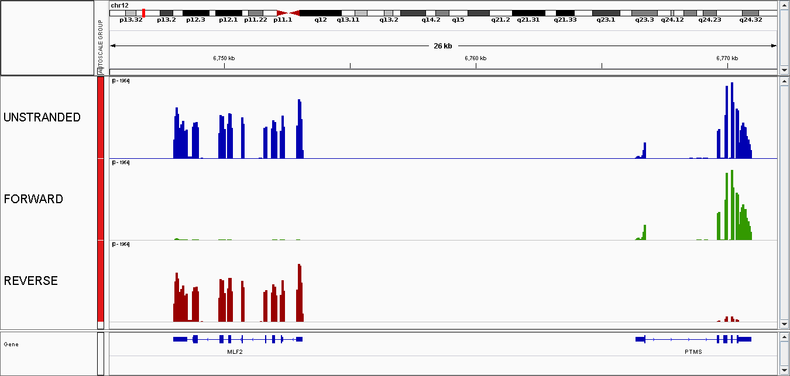
### Mapping QC
[Qualimap](http://qualimap.bioinfo.cipf.es/) is used to check the mapping quality. You'll find qualimap reports in `output/PROJECTNAME/genome/alignmentQC`. Those reports contain a lot of information:
- information about the mapper
- number/% of mapped reads/pairs
- number of indels and mismatches
- coverage per chromosome
- insert size histogram
- ...  

If not already done, you can get the files on your computer running:
```
You@YourComputer:~$ scp -pr username@core.cluster.france-bioinformatique.fr:/shared/projects/YourProjectName/RASflow_IFB/output/PROJECTNAME/genome/alignmentQC PathTo/WhereYouWantToSave/
```
Once again **MultiQC** aggregates the results of all the samples and you can have a quick overview by looking at `output/PROJECTNAME/genome/report_align_count.html`. 

### Count Tables

Depending on the tool you use, the count tables can be found in `output/PROJECTNAME/genome/countFile_htseq-count/` or in `output/PROJECTNAME/genome/countFile_featureCounts`. The `count.tsv` files are the tables

`GeneID  counts`

The `.summary` contains information about the reads that couldn't be attributed to a feature:
```
[mhennion @ clust-slurm-client 16:32]$ RASflow : cat output/LXACT_1/genome/countFile_htseq-count/D197-D192T27_table.tsv.summary
__no_feature	2577896
__ambiguous	7760223
__too_low_aQual	2567823
__not_aligned	350693
__alignment_not_unique	7726115
```

In addition, 2 PDF are generated: 
- `PCA.pdf` : it contains two figures 
  - distribution of raw counts / samples
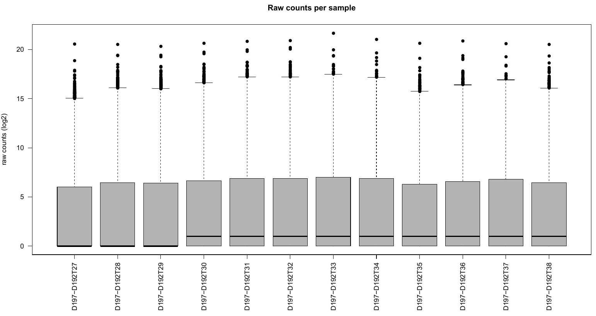
  - PCA of all the samples, colored by group
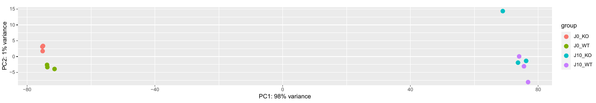
- `Heatmap.pdf` with a heatmap of sample distances 
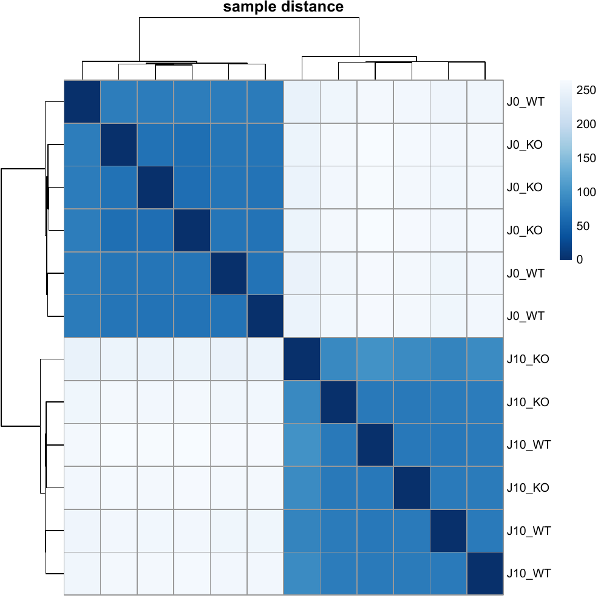

Nota: I didn't manage to do all in one, I have to spend more time in generating a nice report.

MultiQC is run after the counting and you can find a report named `report_count_htseq-count.html` or `report_count_featureCounts.html` in `output/PROJECTNAME/genome/`, that will help you to check that everything went fine. 

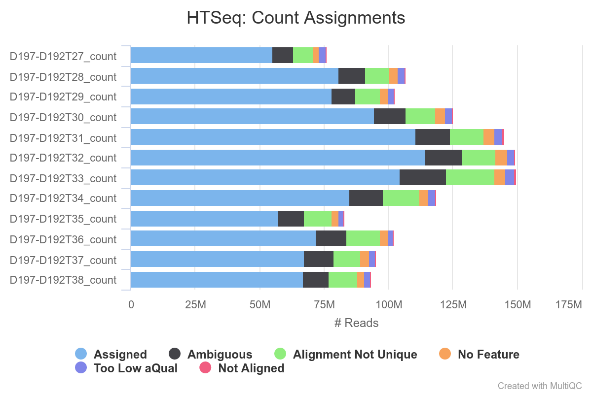


### DEA results

DEA results are in `output/PROJECTNAME/genome/dea_featureCounts` or `dea_htseq-count`. 
- In `output/PROJECTNAME/genome/dea_htseq-count/countGroup/` are raw count tables per group (`group_gene_count.tsv`).  
- Normalized counts can be found in `Norm_DESeq2/` or `Norm_edgeR/`. 
- In `output/PROJECTNAME/genome/dea_htseq-count/DEA_DESeq2` or `DEA_edgeR`, you'll find the results for each pair of conditions: 
    - dea_J0_WT_J0_KO.tsv contains differential expression for all genes
    - deg_J0_WT_J0_KO.tsv contains only the genes differentially expressed (FDR < 0.05)
- In `output/PROJECTNAME/genome/dea/visualization_DESeq2/` or `visualization_edgeR/`, you'll find for each pair of conditions:
    - Volcano plots representing differential expression 
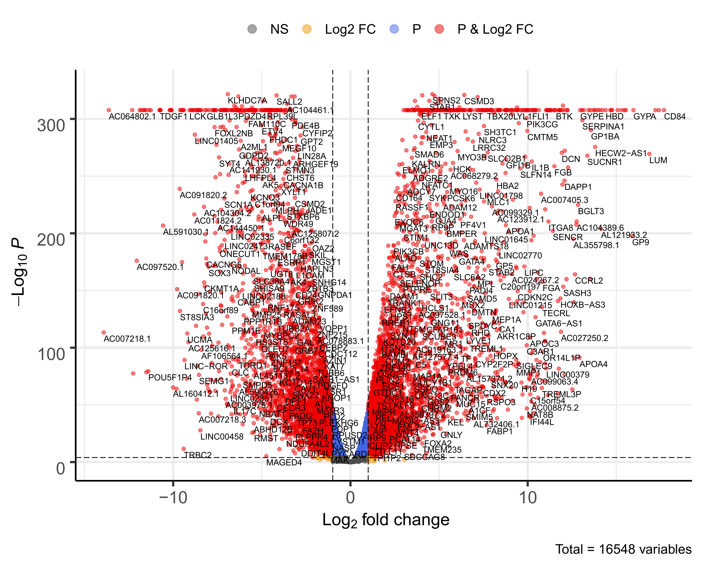
    - A heatmap of the 20 most regulated genes


#### regionReport 

In addition a report is generated by [regionReport](http://leekgroup.github.io/regionReport/reference/index.html) using `DESeq2Report()` or `edgeReport()`. This report can be found in `output/LXACT_1/genome/dea/Report_DESeq2` or `Report_edgeR`. 

Those files contains interesting plots, such as 

- PCA

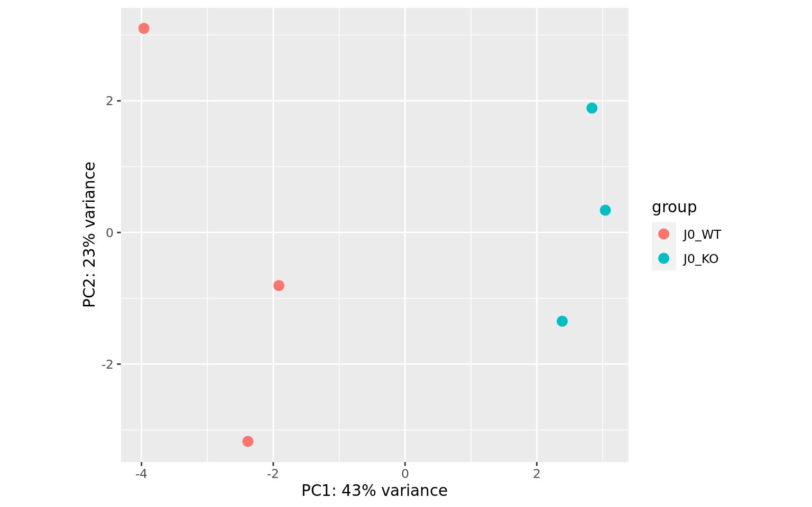

- Sample-to-sample distance heatmap

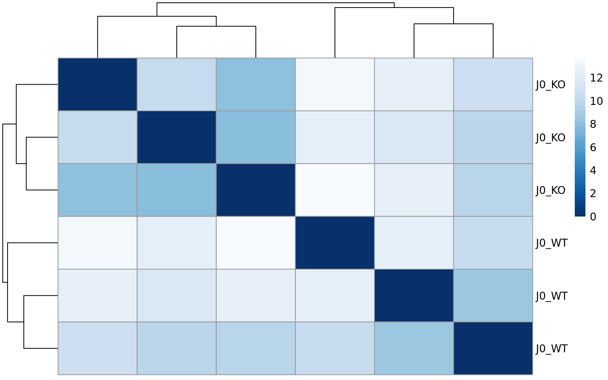

- MA plots

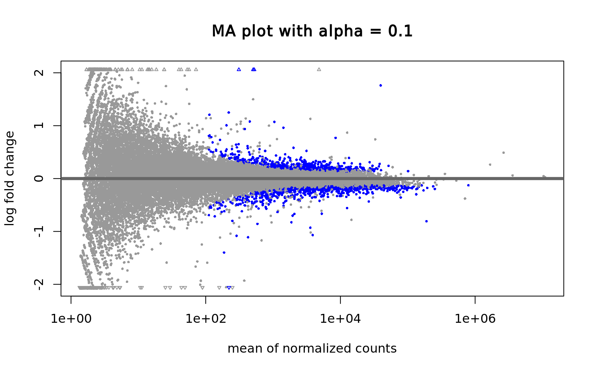

- P-values distribution

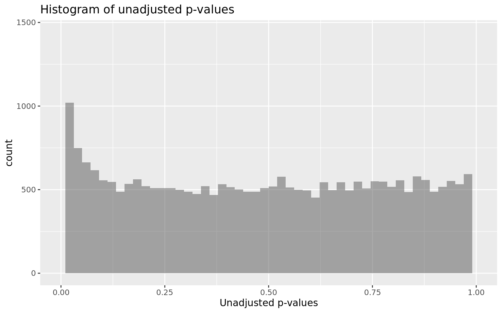

- Count plots for top features

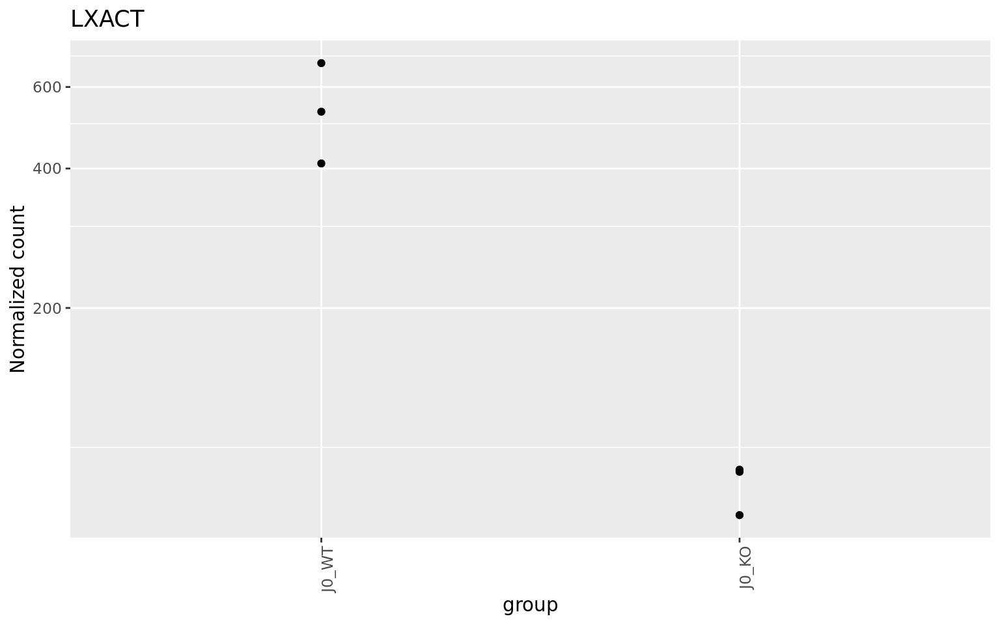

as well as a table with top features 

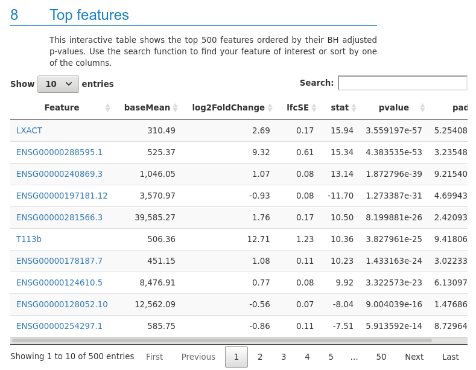

and information about all the tools used to facilitate reproducibility. 

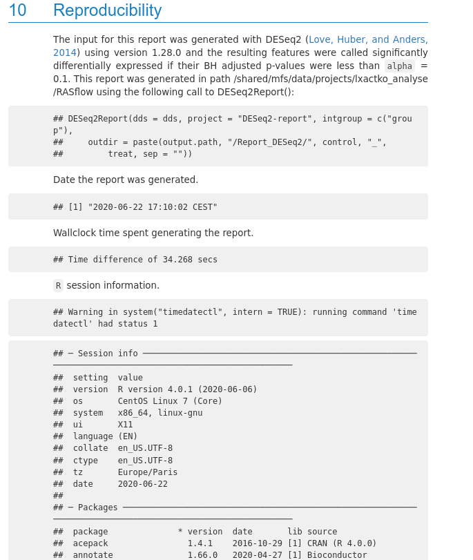

---

## How to follow your jobs

### Running jobs
```
[username@clust-slurm-client RASflow_IFB]$ squeue -u username
```

### Information about past jobs

The `sacct` command gives you information about past and running jobs. The documentation is [here](https://slurm.schedmd.com/sacct.html). You can get different information with the `--format` option. For instance: 

```
[username@clust-slurm-client RASflow_IFB]$ sacct --format=JobID,JobName,Start,CPUTime,MaxRSS,ReqMeM,State
       JobID    JobName               Start    CPUTime     MaxRSS     ReqMem      State 
------------ ---------- ------------------- ---------- ---------- ---------- ---------- 
8016984      snakejob.+ 2020-05-14T11:16:35   01:04:18                6000Mn  COMPLETED 
8016984.bat+      batch 2020-05-14T11:16:35   01:04:18   3809132K     6000Mn  COMPLETED 
8016988      snakejob.+ 2020-05-14T11:18:24   01:06:40                6000Mn  COMPLETED 
8016988.bat+      batch 2020-05-14T11:18:24   01:06:40   3662960K     6000Mn  COMPLETED 
8018092      snakejob.+ 2020-05-14T11:23:54   01:49:52                6000Mn  COMPLETED 
8018092.bat+      batch 2020-05-14T11:23:54   01:49:52   3650812K     6000Mn  COMPLETED 
8024116      snakejob.+ 2020-05-14T13:48:56   00:01:48                2000Mn  COMPLETED 
8024116.bat+      batch 2020-05-14T13:48:56   00:01:48    113456K     2000Mn  COMPLETED 
```
Here you have the job ID and name, its starting time, its running time, the maximum RAM used, the memory you requested (it has to be higher than MaxRSS, otherwise the job fails, but not much higher to allow the others to use the resource), and job status (failed, completed, running). 

**Add `-S MMDD` to have older jobs (default is today only).** 

```
[mhennion@clust-slurm-client RASflow]$ sacct --format=JobID,JobName,Start,CPUTime,MaxRSS,ReqMeM,State -S 0518
```
### Cancelling a job
If you want to cancel a job: scancel job number
```
[username@clust-slurm-client RASflow_IFB]$ scancel 8016984
```
Nota: when snakemake is working on a folder, this folder is locked so that you can't start another DAG and create a big mess. If you cancel the main job, snakemake won't be able to unlock the folder (see [below](#error)). 

---

## Tricks 

### Make aliases
To save time avoiding typing long commands again and again, you can add aliases to your `.bashrc` file: 

``` 
[mhennion@clust-slurm-client RASflow]$ cat ~/.bashrc 
# .bashrc

# Source global definitions
if [ -f /etc/bashrc ]; then
	. /etc/bashrc
fi

# Uncomment the following line if you don't like systemctl's auto-paging feature:
# export SYSTEMD_PAGER=

# User specific aliases and functions

alias qq="squeue -u username"
alias sa="sacct --format=JobID,JobName,Start,CPUTime,MaxRSS,ReqMeM,State"
alias ll="ls -lht --color=always"
```
It will work next time you connect to the server. When you type `sa`, you will get the command `sacct --format=JobID,JobName,Start,CPUTime,MaxRSS,ReqMeM,State` running. 

---

## Common errors

### Memory 
I set up the memory necessary for each rule, but it is possible that big datasets induce a memory excess error. In that case the job stops and you get in the corresponding slurm output something like this: 

```
slurmstepd: error: Job 8430179 exceeded memory limit (10442128 > 10240000), being killed
slurmstepd: error: Exceeded job memory limit
slurmstepd: error: *** JOB 8430179 ON cpu-node-13 CANCELLED AT 2020-05-20T09:58:05 ***
Will exit after finishing currently running jobs.
```
In that case, you can increase the memory request by modifying the file `cluster.yml`. 
```
[username@clust-slurm-client RASflow_IFB]$ cat cluster.yml 
__default__:
  mem: 2000

qualityControl:
  mem: 6000

trim:
  mem: 6000

alignment:
  mem: 30000

sortBAM:
  mem: 40000

alignmentQC:
  mem: 7000

BigWig:
  mem: 70000

BigWigR:
  mem: 70000

BigWigF:
  mem: 70000

featureCount:
  mem: 20000
```
If the rule that failed is not listed here, you can add it respecting the format. And restart your workflow. 
<a name="error">

### Folder locked
</a>

When snakemake is working on a folder, this folder is locked so that you can't start another DAG and create a big mess. If you cancel the main job, snakemake won't be able to unlock the folder and next time you run `Workflow.sh`, you will get the following error:

```
Error: Directory cannot be locked. Please make sure that no other Snakemake process is trying to create the same files in the following directory:
/shared/mfs/data/projects/lxactko_analyse/RASflow
If you are sure that no other instances of snakemake are running on this directory, the remaining lock was likely caused by a kill signal or a power loss. It can be removed with the --unlock argument.
```
In order to remove the lock, run:
```
[username@clust-slurm-client RASflow_IFB]$ sbatch Unlock.sh
```
Then you can restart your workflow. 


### Storage space
Sometimes you may reach the quota you have for your project. To check the quota, run: 
```
[username@ clust-slurm-client ]$ RASflow_IFB : mfsgetquota -H /shared/projects/YourProjectName/
```
In principle it should raise an error, but sometimes it doesn't and it's hard to find out what is the problem. So if a task fails with no error (typically the mapping or featureCounts), try to make more space (or ask for more space on Community [support](https://community.cluster.france-bioinformatique.fr)) before trying again. 


---

## Good practice
- Always save **job ID** or the **date_time** (ie 20200615_1540) in your notes when launching `Workflow.sh`. It's easier to find the outputs you're interested in days/weeks/months/years later.